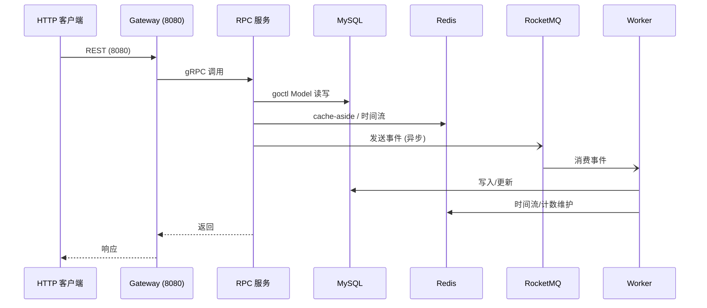
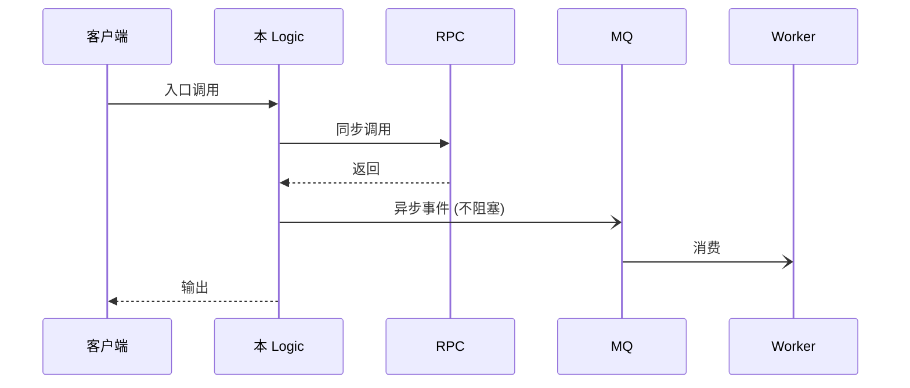
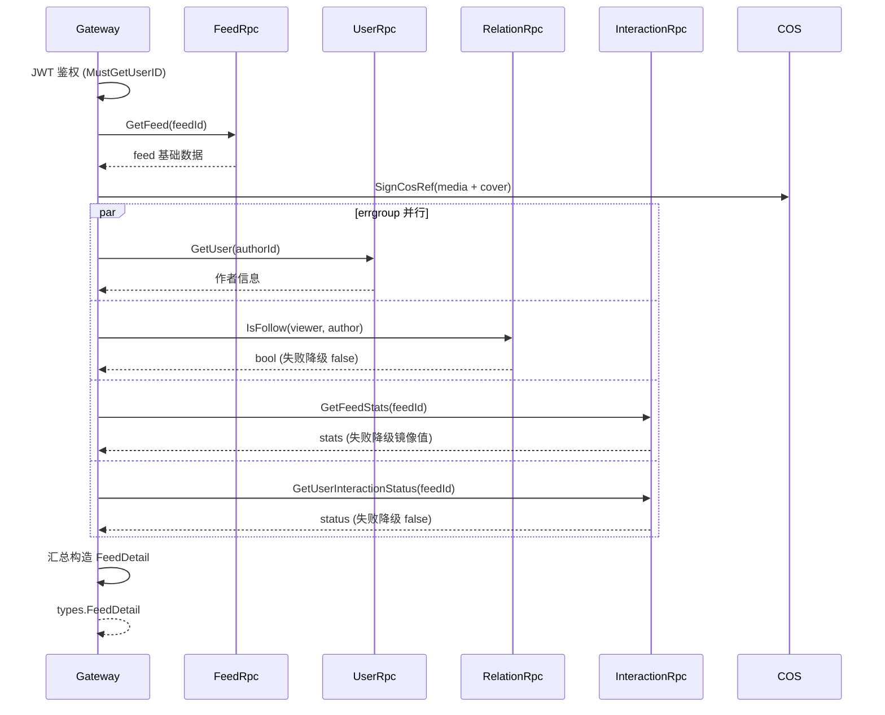

# Logic 数据流生成提示词（Logic Dataflow Prompt Guide）

> 提供一份可直接复制使用的提示词，用于为任意 `logic` 文件生成「数据流说明」文档；同时规定数据流文档的统一输出格式与质量标准。每份 logic 调用一次提示词，即可逐步覆盖 `app/gateway/internal/logic/` 与各 `app/<svc>/rpc/internal/logic/` 下的全部 logic。

---

## 1. 适用范围

- **适用对象**：本项目所有手写业务逻辑文件——Gateway BFF 逻辑（`app/gateway/internal/logic/**`）、RPC 服务逻辑（`app/<svc>/rpc/internal/logic/*Logic.go`）、服务内 Worker 消费函数（`app/<svc>/rpc/internal/worker/*.go`），以及被复用的 helper/aggregate 方法（`*Helper.go`、`helper.go`、`aggregate/*.go`）。
- **不适用**：`goctl`/`protoc` 自动生成文件（`*_gen.go`、`*_grpc.pb.go`、`*.pb.go`）、配置文件、测试文件。
- **产出位置**：按 [`doc-writing-guide.md`](./doc-writing-guide.md) 归类——生成的单条 logic 数据流说明属「方案描述类」，归入 `docs/design/<service>/` 下对应子目录；本文件本身属「规范类」，留于 `docs/agent/`。

## 2. 背景速览（提示词使用者必读）

本项目为 go-zero 微服务 Feed 流系统，整体数据流：



两类 logic 的典型差异：

| 维度 | Gateway logic | RPC logic |
|------|---------------|-----------|
| 入口 | HTTP handler 调用，路由见 `app/gateway/api/*.api` | gRPC 方法，契约见 `api/proto/<svc>/*.proto` |
| 身份 | `middleware.MustGetUserID(l.ctx)`（JWT 中间件写入） | 由上游透传，方法参数带 `userId` |
| 职责 | BFF 聚合：校验、并行调多 RPC、COS 签名、IP 解析、字段映射 | 单服务业务：校验、Model/Redis 读写、发事件 |
| 返回 | `types.*`（`app/gateway/internal/types/types.go`） | proto 生成的 pb 结构 |
| 依赖 | `svcCtx` 持有全部下游 RPC client + `IPResolver` + `Cos` + `Producer` | `svcCtx` 持有本服务 Model/Redis/IdGen/Producer/Consumer + 个别下游 RPC |

写链路数据流需特别注意三类异步副作用：

1. **「先写 DB，再发事件」**（feed 发帖）：DB 落库成功即返回，MQ 失败仅记日志不阻塞（由 Worker/本地消息表兜底）。
2. **「Redis 先行 + MQ 异步落库」**（interaction 点赞/收藏）：Redis 更新成功即返回，异步发事件落库，重复操作幂等。
3. **Worker 消费**（feed/interaction/comment 的 `internal/worker`）：消费 MQ 事件完成时间流写入、计数增量等，消费函数本身就是「副作用主流程」。

## 3. 提示词正文（可直接复制）

> 使用前将 `<尖括号>` 内的占位符替换为目标文件信息；保留所有未标注占位符的内容不变。

````text
# 任务

请为以下业务逻辑文件生成一份「数据流说明」文档：

- 目标文件：`<目标文件的仓库相对路径，如 app/gateway/internal/logic/feed/getFeedDetailLogic.go>`
- 所属服务：`<gateway / user / relation / feed / comment / interaction / content>`
- 文件类型：`<Gateway logic / RPC logic / Worker 消费函数 / helper 方法>`

## 背景

这是 go-zero 微服务 Feed 项目（类抖音/小红书 Feed 流）。总体数据流：
HTTP(Gateway) → Gateway Logic（BFF 聚合）→ gRPC → RPC Logic → Model/Redis/COS；
写链路可能发送 RocketMQ 事件，由各服务 Worker 异步消费完成副作用（时间流写入、计数维护等）。
项目约定（务必遵守）：
- 业务错误统一使用 `common/errorx` 错误码，禁止透传裸 error 语义描述。
- 读多写少走 Redis cache-aside：命中返回，未命中回源 DB 并回写（回写失败不阻塞）。
- 写链路遵守「先写 DB 再删/更新缓存」「缓存失败不阻塞主流程」；interaction 等高频写采用「Redis 先行 + MQ 异步落库」。
- 业务实体 ID 由 `common/idgen`（Snowflake）生成。
- 服务间依赖避免循环：例如 Feed 不依赖 Comment RPC，评论计数由 Worker 消费事件增量维护镜像列。
- 降级是有意设计：部分下游失败降级（false/镜像值），部分整体失败，需在文档中区分。

## 分析前必读（按顺序阅读，全部完成后再动笔）

1. 目标文件本身（含文件头注释，其中常已写明职责与降级约定）。
2. 该文件所在服务的 `internal/svc/serviceContext*.go`（gateway 为 `app/gateway/internal/svc/serviceContext.go`）：列出该文件可用的全部依赖。
3. 该服务 `internal/keys/*.go`：Redis key 统一命名约定。
4. 入口契约：
   - RPC logic：`api/proto/<svc>/<svc>.proto` 中对应 rpc 方法及 Req/Resp 字段注释；
   - Gateway logic：`app/gateway/api/*.api` 中对应路由（method + path）与类型定义；
   - Worker/helper：注明无对外入口。
5. 目标文件调用的所有下游 RPC 的 proto 与 client 方法（`api/proto/**`）。
6. `common/errorx/errorx.go`：确认返回的每个错误码的业务语义。
7. 涉及的事件结构（`common/event/**`）与消费方（`internal/worker/*`），确认事件的 topic、字段、消费动作。
8. 若为聚合逻辑（如 `aggregate/*.go`），补充阅读其调用方与 `types.*` 定义。

## 输出要求

生成的数据流说明必须覆盖以下 8 个要素，顺序保持一致；无需单独建"概述"节，开篇即「入口与前置」。

### 1. 入口与前置
- 触发方式：HTTP 路由（method + path）或 gRPC 方法名；Worker 消费函数注明「异步入口，topic：xxx」。
- 鉴权与身份来源（如 `middleware.MustGetUserID`）、IP 解析、request_id 注入等前置处理。

### 2. 参数校验
- 逐条列出校验点、校验内容、失败返回的错误码（含带消息的错误码 `NewWithMsg` 场景）。

### 3. 主流程
- 按执行顺序列出每个步骤，写明数据源与关键变换：
  - 读/写 Redis：key 模式（如 `feed:{feed_id}`）、结构、TTL、命中/回源/回写路径；
  - 读/写 MySQL：表名 + Model 方法名；
  - 下游调用：RPC 服务 + 方法名；
  - 变换：JSON 序列化（如 media_urls）、毫秒/秒时间戳换算、COS 签名（`SignCosRef`）、cursor 互转等。
- 用「1. 2. 3.」编号；并行步骤标注「（并行，errgroup）」及各自的失败策略。

### 4. 依赖数据源清单
用表格列出本 logic 涉及的全部数据源：

| 类型 | 名称 | 用途 | 关键说明 |
|------|------|------|----------|
| RPC | `<svc>.<method>` | 作用 | 失败策略 |
| Redis | `<key 模式>` | 作用 | 结构/TTL/读写路径 |
| MySQL | `<表名>.<Model 方法>` | 作用 | 读写方向 |
| MQ | `<topic>` | 作用 | 同步/异步、失败策略 |
| 外部 | `<COS/IPResolver 等>` | 作用 | 说明 |

### 5. 失败与降级策略
- 对每个失败点明确三选一：**整体失败**（返回错误码/透传）、**降级**（降级成什么值或什么数据源）、**忽略**（仅记日志）。
- 说明幂等设计（唯一索引、SETNX 去重、幂等写 Redis 等）。

### 6. 副作用（函数返回后发生的事）
- MQ 事件：topic、payload 关键字段、由哪个 Worker 消费、消费后做什么。
- 异步缓存回写 / 缓存失效。
- 若目标文件本身就是 Worker 消费函数，则其主流程即副作用，此处改为「下游影响面」。

### 7. 输出
- 响应结构名、关键字段来源映射与变换（哪些字段直接透传、哪些来自聚合/签名）。

### 8. 数据流图（Mermaid 时序图）
- 用 Mermaid `sequenceDiagram` 绘制，覆盖「入口 → 前置 → 各数据源 → 输出 → 异步副作用」：
  - `participant` 声明参与者（Client/Gateway/RPC/MySQL/Redis/MQ/Worker/COS 等）；
  - `->>` 同步调用，`-->>` 返回，`-)` 异步消息（不阻塞），`--)-` 异步回调；
  - `par...and...end` 并行调用，`alt...else...end` 分支，`Note over` 标注关键说明；
  - 在箭头上标注具体方法名、key 模式、表名；
  - 异步段用 `-)` 箭头明确区分，不混入同步主流程。

## 质量标准（违反任一即返工）

1. **与代码逐字一致**：Redis key 模式、RPC 方法名、表名、错误码、topic 必须与代码核对，禁止凭印象填写。
2. **失败策略不遗漏**：每个 `err` 分支都要归类（整体失败/降级/忽略），降级要写明降级值。
3. **区分同步与异步**：主流程与 Worker 副作用不得混淆。
4. **标注已知缺陷**：代码注释中的 `TODO`、已知陷阱、降级窗口如实写入文档。
5. **文档规范**：遵循 `docs/agent/doc-writing-guide.md`（一级标题 + 引用块 + `---`、kebab-case 文件名、结尾 `## 关联文档` 相对路径互链）。
6. **只做描述不改代码**：本次任务只产出文档，禁止修改任何 `.go` / `.proto` / `.api` 文件。

## 输出格式

直接输出一份完整 Markdown 文档（无需额外解释），文档模板见下节；文档正文首行为 `# <Logic名> 数据流`。
````

## 4. 输出模板（数据流文档统一结构）

提示词要求生成的数据流文档采用以下固定模板（`<Logic名>` 为文件去掉 `Logic.go` 后缀的方法语义名，如 `GetFeedDetail`）：

```markdown
# <Logic名> 数据流

> 一句话职责（与目标文件头注释一致）。

---

## 1. 入口与前置

- 入口：<HTTP 路由 或 gRPC 方法 或 异步 MQ topic>
- 前置：<鉴权/身份/IP/request_id>

## 2. 参数校验

| 校验点 | 内容 | 失败错误码 |
|--------|------|-----------|
| ... | ... | ... |

## 3. 主流程

1. ...
2. ...（并行，errgroup：作者信息失败整体失败；互动状态失败降级 false）
3. ...

## 4. 依赖数据源清单

| 类型 | 名称 | 用途 | 关键说明 |
|------|------|------|----------|
| ... | ... | ... | ... |

## 5. 失败与降级策略

| 失败点 | 策略 | 说明 |
|--------|------|------|
| ... | 整体失败 / 降级为 xxx / 忽略 | ... |

## 6. 副作用

- MQ：`<topic>`（字段…）→ `<svc> Worker` 消费后…
- 缓存：异步回写 `<key>`

## 7. 输出

- `<Resp 类型>`：字段映射…

## 8. 数据流图



## 关联文档

- <相对路径互链相关设计文档>
```

## 5. 示例（以 `getFeedDetailLogic.go` 为样例输出）

以下为对 `app/gateway/internal/logic/feed/getFeedDetailLogic.go` 应用提示词后应产出的文档示范（节选核心部分）。

```markdown
# GetFeedDetail 数据流

> 职责：帖子详情页 BFF 聚合：先取帖子基础数据，再用 errgroup 并行聚合作者、关注、互动数据。

---

## 1. 入口与前置

- 入口：`GET /api/v1/feeds/:id`（见 `app/gateway/api/feed.api`）
- 前置：JWT 鉴权 → `middleware.MustGetUserID` 取 viewer 身份；`feedId` 校验

## 2. 参数校验

| 校验点 | 内容 | 失败错误码 |
|--------|------|-----------|
| viewer | 未登录 | `errorx.Unauthorized` |
| feedId | `<= 0` | `errorx.ParamError`（带消息"feedId 非法"） |

## 3. 主流程

1. `FeedRpc.GetFeed` 取帖子基础数据（feed 服务内走 `feed:{id}` 缓存，见 feed 侧文档）；`resp.Feed == nil` → `FeedNotFound`。
2. 私有桶媒体地址 `SignCosRef` 签名（media + cover），构造 `detail`（计数先用 feed 镜像值兜底）。
3. 并行聚合（errgroup）：
   - `UserRpc.GetUser` 作者信息——失败整体失败；
   - `RelationRpc.IsFollow` viewer 是否关注作者——失败降级 false；
   - `InteractionRpc.GetFeedStats` 点赞/收藏计数——失败降级镜像值；
   - `InteractionRpc.GetUserInteractionStatus` 互动状态——失败降级 false。
4. `g.Wait()` 汇总，返回 `types.FeedDetail`。

## 4. 依赖数据源清单

| 类型 | 名称 | 用途 | 关键说明 |
|------|------|------|----------|
| RPC | feed.GetFeed | 帖子基础数据 | 失败整体失败 |
| RPC | user.GetUser | 作者信息 | 失败整体失败 |
| RPC | relation.IsFollow | 是否关注作者 | 失败降级 false |
| RPC | interaction.GetFeedStats | 点赞/收藏计数 | 失败降级 feed 镜像值 |
| RPC | interaction.GetUserInteractionStatus | 互动状态 | 失败降级 false |
| 外部 | COS `SignCosRef` | 私有桶签名 | 客户端可直接访问 |

## 5. 失败与降级策略

| 失败点 | 策略 | 说明 |
|--------|------|------|
| GetFeed / GetUser | 整体失败 | 详情无基础数据无意义 |
| IsFollow / 互动状态 | 降级 | false |
| GetFeedStats | 降级 | feed 镜像计数 |

## 6. 副作用

- 无 MQ 事件（纯读路径）。
- feed 详情缓存由 feed 服务 GetFeed 内部回写，本 logic 不直接触碰。

## 7. 输出

- `types.FeedDetail`：`ID/Title/…` 直接透传；`MediaUrls/CoverURL/Avatar` 为签名后 URL；`Stats` 优先 interaction 结果、失败用镜像值。

## 8. 数据流图


```

## 6. 使用流程

1. **定位**：按 §2 判断目标文件属于哪类 logic，确认其所在服务。
2. **替换占位符**：将 §3 提示词中的 `<目标文件路径>`、`<所属服务>`、`<文件类型>` 替换为实际值。
3. **执行**：将替换后的提示词交给 AI（或在本仓库内直接发起该任务）；AI 需先完成「分析前必读」再输出。
4. **落盘**：将产出文档存至 `docs/design/<service>/` 对应子目录（如帖子详情聚合存 `docs/design/feed/`），文件名 kebab-case，并更新所在目录 `README.md` 索引。
5. **批量覆盖**：对每个 logic 文件重复步骤 1-4，直至覆盖全部逻辑；Worker 消费函数与 helper/aggregate 方法同样适用。

## 7. 检查清单（提交前自检）

- [ ] 文档中的 Redis key、RPC 方法、表名、错误码、topic 与代码逐字一致。
- [ ] 每个错误分支都归入「整体失败 / 降级 / 忽略」之一，降级写明降级值。
- [ ] 同步主流程与异步副作用（MQ/Worker/缓存回写）已区分。
- [ ] `TODO`、已知缺陷、一致性窗口已如实标注。
- [ ] 数据流图使用 Mermaid `sequenceDiagram` 格式，含具体 key/方法/表名，异步段用 `-)` 区分。
- [ ] 文档符合 `doc-writing-guide.md`（文件头、kebab-case、`## 关联文档` 相对链接）。
- [ ] 未修改任何 `.go` / `.proto` / `.api` 文件（本次任务只产出文档）。

---

## 关联文档

- [agent 目录索引](./README.md)
- [文档编写规范](./doc-writing-guide.md)
- [架构设计](../design/architecture.md)
- [服务设计](../design/service-design.md)
- [数据模型](../design/data-model.md)
