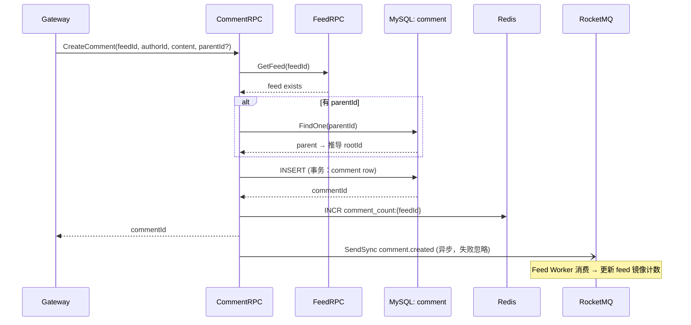
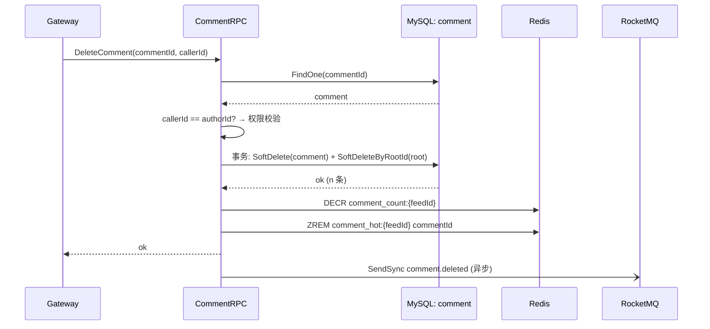
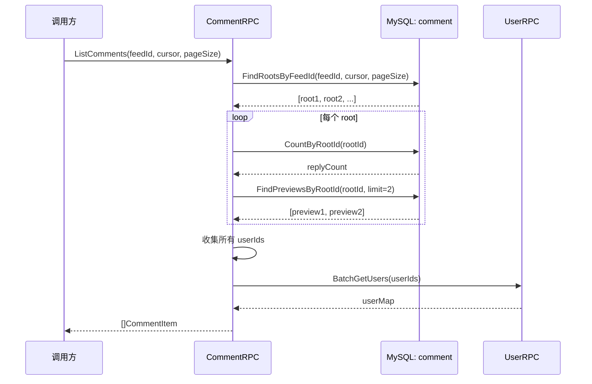
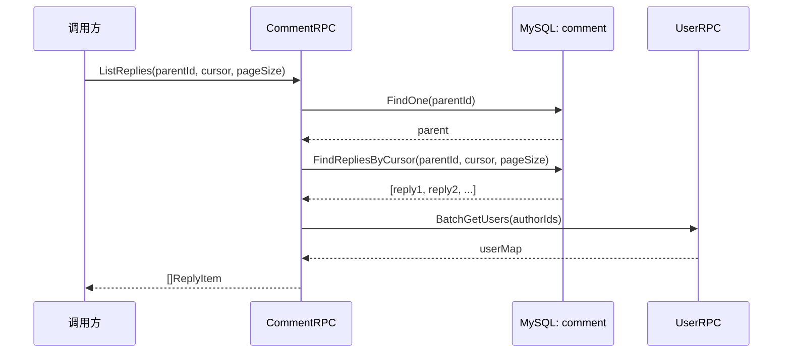
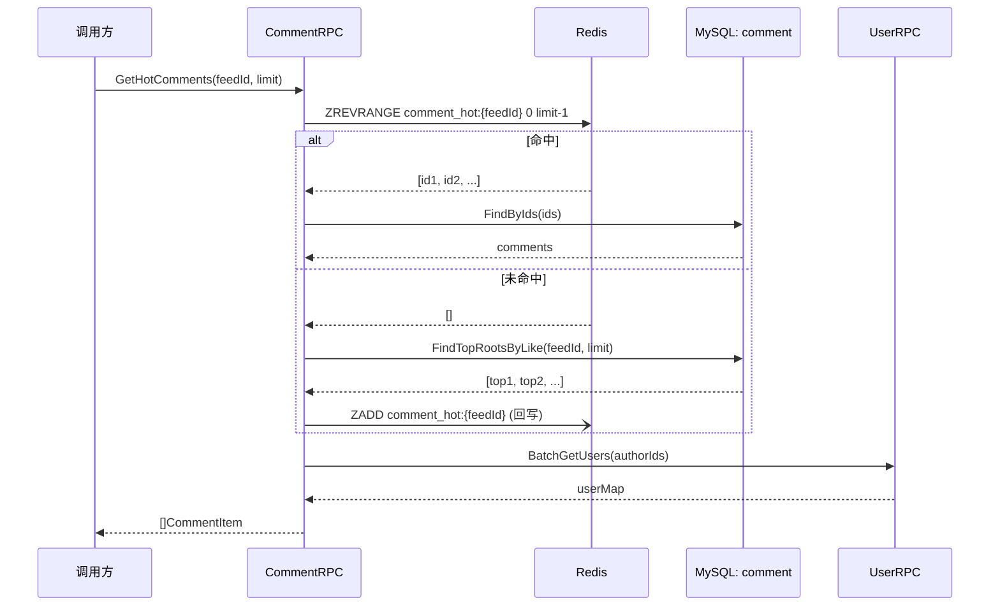
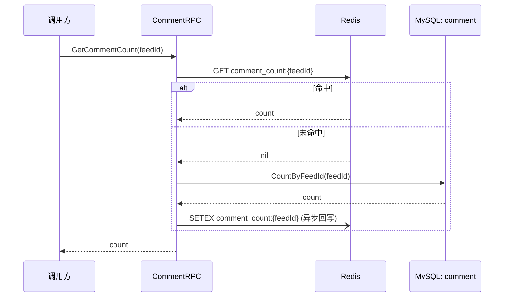
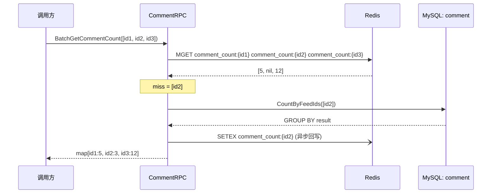

# Comment 服务数据流

> 覆盖 `app/comment/rpc/internal/logic/` 下全部 7 个 logic + 1 个 helper 的数据流说明。

---

## CreateComment

> 职责：发表评论——Feed 存在校验 → 父评论推导 → 单事务插入 → Redis 增量 → 异步发 MQ 事件。

### 1. 入口与前置

- 入口：gRPC `Comment.CreateComment`
- 前置：Gateway 已校验 JWT，传入 authorId

### 2. 参数校验

| 校验点 | 内容 | 失败错误码 |
|--------|------|-----------|
| feedId | `<= 0` | `errorx.ParamError` |
| content | 非空且长度限制 | `errorx.ParamError` |
| parentId | 若为回复则需非零 | — |

### 3. 主流程

1. `FeedRpc.GetFeed(feedId)` 确认帖子存在 → nil → `errorx.FeedNotFound`
2. 若 `parentId != 0`：`FindOne(parentId)` 查父评论 → 推导 `rootId`（一级评论 rootId=自身 id，回复 rootId=父评论 rootId）
3. `IdGen.Next()` 生成 commentId
4. 单事务：`Insert(comment)` MySQL — 含 rootId、parentId、feedId、authorId、content
5. `INCR comment_count:{feedId}` Redis 增量
6. 异步：`SendSync(comment.created, feedId, commentId, authorId, rootId)` MQ

### 4. 依赖数据源清单

| 类型 | 名称 | 用途 | 关键说明 |
|------|------|------|----------|
| RPC | `FeedRpc.GetFeed` | 帖子存在校验 | 失败整体失败 |
| MySQL | `comment.FindOne` | 父评论 rootId 推导 | — |
| MySQL | `comment.Insert` | 落库（事务内） | — |
| Redis | `INCR comment_count:{feedId}` | 计数 | — |
| MQ | `comment.created` | 异步事件 | 由 Feed Worker 消费更新镜像计数 |

### 5. 失败与降级策略

| 失败点 | 策略 | 说明 |
|--------|------|------|
| 帖子不存在 | 整体失败 | `errorx.FeedNotFound` |
| parentId 无效 | 整体失败 | 父评论不存在 |
| DB 事务失败 | 整体失败 | 回滚 |
| INCR 失败 | 忽略 | 计数可能有短暂不一致，后续 MQ 兜底 |
| MQ 发送失败 | 忽略 | 仅记日志 |

### 6. 副作用

- Redis INCR `comment_count:{feedId}`
- MQ：`comment.created` → Feed Worker 消费 → 更新 feed 镜像计数

### 7. 输出

- `pb.CreateCommentResp`：`CommentId`

### 8. 数据流图

---

## DeleteComment

> 职责：删除评论——软删整楼 → 所有回复减量 → Redis DECR → 异步发 MQ。

### 1. 入口与前置

- 入口：gRPC `Comment.DeleteComment`
- 前置：Gateway 已校验 JWT，传入 callerId

### 2. 参数校验

| 校验点 | 内容 | 失败错误码 |
|--------|------|-----------|
| commentId | `<= 0` | `errorx.ParamError` |

### 3. 主流程

1. `FindOne(commentId)` 确认存在 + 权限校验（callerId == authorId）
2. 单事务：
   - SoftDelete 该评论
   - 若该评论是一级评论（rootId == id）：`SoftDeleteByRootId(rootId)` 连带软删所有回复
3. `DECR comment_count:{feedId}`（减量 = 1 + 回复数）
4. `ZREM comment_hot:{feedId} commentId` 移除热门候选
5. 异步：`SendSync(comment.deleted, ...)` MQ

### 4. 依赖数据源清单

| 类型 | 名称 | 用途 | 关键说明 |
|------|------|------|----------|
| MySQL | `comment.FindOne` | 确认存在+权限 | — |
| MySQL | `comment.SoftDelete + SoftDeleteByRootId` | 事务软删 | — |
| Redis | `DECR comment_count:{feedId}` | 减量 | — |
| Redis | `ZREM comment_hot:{feedId}` | 移除热门 | — |
| MQ | `comment.deleted` | 异步事件 | Feed Worker 消费 |

### 5. 失败与降级策略

| 失败点 | 策略 | 说明 |
|--------|------|------|
| 评论不存在 | 整体失败 | — |
| 非作者 | 整体失败 | `errorx.Forbidden` |
| DECR/ZREM 失败 | 忽略 | MQ 兜底 |
| MQ 发送失败 | 忽略 | 仅记日志 |

### 6. 副作用

- Redis DECR / ZREM。
- MQ：`comment.deleted` → Feed Worker 更新镜像计数。

### 7. 输出

- `pb.DeleteCommentResp`：确认消息

### 8. 数据流图

---

## ListComments

> 职责：评论列表——查 root 评论 → 批量取评论数 → 窗口函数取预览 → 批量取用户。

### 1. 入口与前置

- 入口：gRPC `Comment.ListComments`
- 前置：无

### 2. 参数校验

| 校验点 | 内容 | 失败错误码 |
|--------|------|-----------|
| feedId | `<= 0` | `errorx.ParamError` |
| cursor/pageSize | 分页参数 | `errorx.ParamError` |

### 3. 主流程

1. `FindRootsByFeedId(feedId, cursor, pageSize)` MySQL 取一级评论列表
2. 对每一条 root 评论：`CountByRootId(rootId)` 获取回复数（实时查 MySQL 或 Redis 缓存）
3. 对每一条 root 评论：`FindPreviewsByRootId(rootId, limit=2)` 窗口函数取最新 2 条回复预览
4. 收集全部 userId（roots + previews）→ `BatchGetUsers(userIds)` RPC
5. 组装列表

### 4. 依赖数据源清单

| 类型 | 名称 | 用途 | 关键说明 |
|------|------|------|----------|
| MySQL | `comment.FindRootsByFeedId` | 分页取一级评论 | WHERE parent_id IS NULL |
| MySQL | `comment.CountByRootId` | 每楼回复数 | — |
| MySQL | `comment.FindPreviewsByRootId` | 窗口函数取预览 | ROW_NUMBER() OVER PARTITION BY root_id |
| RPC | `UserRpc.BatchGetUsers` | 批量取用户头像/昵称 | 失败降级空信息 |

### 5. 失败与降级策略

| 失败点 | 策略 | 说明 |
|--------|------|------|
| BatchGetUsers 失败 | 降级 | 用户信息为空 |

### 6. 副作用

- 无。

### 7. 输出

- `pb.ListCommentsResp`：`[]CommentItem`（含 previews + user）

### 8. 数据流图

---

## ListReplies

> 职责：回复列表——确认父评论存在 → 游标分页取回复 → 批量取用户。

### 1. 入口与前置

- 入口：gRPC `Comment.ListReplies`
- 前置：无

### 2. 参数校验

| 校验点 | 内容 | 失败错误码 |
|--------|------|-----------|
| parentId | `<= 0` | `errorx.ParamError` |
| cursor/pageSize | 分页参数 | `errorx.ParamError` |

### 3. 主流程

1. `FindOne(parentId)` 确认父评论存在
2. `FindRepliesByCursor(parentId, cursor, pageSize)` MySQL 游标分页
3. `BatchGetUsers(userIds)` RPC 取用户信息
4. 组装

### 4. 依赖数据源清单

| 类型 | 名称 | 用途 | 关键说明 |
|------|------|------|----------|
| MySQL | `comment.FindOne` | 确认父评论 | — |
| MySQL | `comment.FindRepliesByCursor` | 游标分页 | WHERE parent_id=? ORDER BY id |
| RPC | `UserRpc.BatchGetUsers` | 用户信息 | 失败降级 |

### 5. 失败与降级策略

| 失败点 | 策略 | 说明 |
|--------|------|------|
| parentId 不存在 | 整体失败 | — |
| BatchGetUsers 失败 | 降级 | 空用户信息 |

### 6. 副作用

- 无。

### 7. 输出

- `pb.ListRepliesResp`：`[]ReplyItem`

### 8. 数据流图

---

## GetHotComments

> 职责：热门评论——ZREVRANGE Redis → 命中取评论 → 未命中 MySQL 回源重建 ZSet。

### 1. 入口与前置

- 入口：gRPC `Comment.GetHotComments`
- 前置：无

### 2. 参数校验

| 校验点 | 内容 | 失败错误码 |
|--------|------|-----------|
| feedId | `<= 0` | `errorx.ParamError` |
| limit | 默认值处理 | — |

### 3. 主流程

1. `ZREVRANGE comment_hot:{feedId} 0 limit-1` Redis
2. 命中 → `FindByIds(ids)` MySQL 取评论内容
3. 未命中 → `FindTopRootsByLike(feedId, limit)` MySQL 按赞数排序取 top
4. 回写 `ZADD comment_hot:{feedId}` 重建热门 ZSet
5. `BatchGetUsers` RPC 取用户

### 4. 依赖数据源清单

| 类型 | 名称 | 用途 | 关键说明 |
|------|------|------|----------|
| Redis | `ZREVRANGE comment_hot:{feedId}` | 热门缓存 | — |
| MySQL | `comment.FindTopRootsByLike` | 回源 | 按点赞数排序 |
| MySQL | `comment.FindByIds` | 取评论内容 | — |
| Redis | `ZADD comment_hot:{feedId}` | 回写 | 失败忽略 |
| RPC | `UserRpc.BatchGetUsers` | 用户信息 | — |

### 5. 失败与降级策略

| 失败点 | 策略 | 说明 |
|--------|------|------|
| Redis 故障 | 降级 | 直接 MySQL FindTopRootsByLike |
| ZADD 回写失败 | 忽略 | 仅记日志 |

### 6. 副作用

- Redis ZADD 重建热门 ZSet。

### 7. 输出

- `pb.GetHotCommentsResp`：`[]CommentItem`

### 8. 数据流图

---

## GetCommentCount / BatchGetCommentCount

> 职责：获取帖子评论数——Redis 单查/批量 → 未命中回源 MySQL → SETEX 回写。

### 1. 入口与前置

- 入口：gRPC `Comment.GetCommentCount` / `BatchGetCommentCount`
- 前置：无

### 2. 参数校验

| 校验点 | 内容 | 失败错误码 |
|--------|------|-----------|
| feedId / feedIds | 非空 | `errorx.ParamError` |

### 3. 主流程

**GetCommentCount（单个）**:
1. `GET comment_count:{feedId}` Redis
2. 命中 → 返回；未命中 → `CountByFeedId(feedId)` MySQL
3. `SETEX comment_count:{feedId} ttl value` 回写

**BatchGetCommentCount（批量）**:
1. `MGET comment_count:{id1} comment_count:{id2} ...` Redis
2. 收集 miss → `CountByFeedIds(missedIds)` MySQL `GROUP BY feed_id`
3. `SETEX` 逐个回写

### 4. 依赖数据源清单

| 类型 | 名称 | 用途 | 关键说明 |
|------|------|------|----------|
| Redis | `GET/MGET comment_count:{feedId}` | 评论数缓存 | — |
| MySQL | `comment.CountByFeedId(s)` | 回源 | GROUP BY |
| Redis | `SETEX` | 回写 | TTL 过期 |

### 5. 失败与降级策略

| 失败点 | 策略 | 说明 |
|--------|------|------|
| Redis 故障 | 降级 | 直接 MySQL CountByFeedId(s) |
| SETEX 失败 | 忽略 | 仅记日志 |

### 6. 副作用

- SETEX 回写。

### 7. 输出

- `pb.*CountResp`：`count` 或 `map[feedId]count`

### 8. 数据流图

**GetCommentCount**:

**BatchGetCommentCount**:

---

## 关联文档

- [Comment 设计总览](./00-overview.md)
- [数据模型](./01-data-model/01-data-model.md)
- [Logic 数据流生成提示词](../../agent/logic-dataflow-guide.md)
