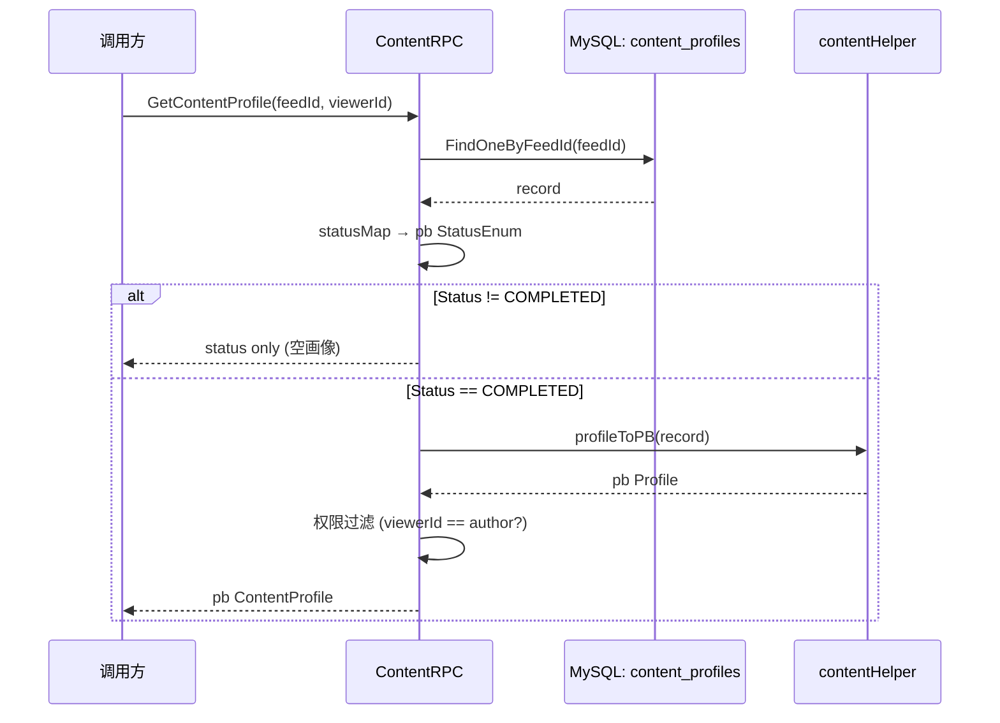
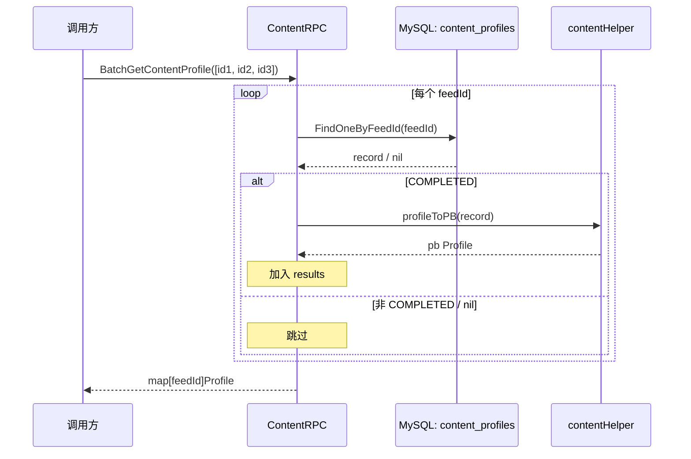
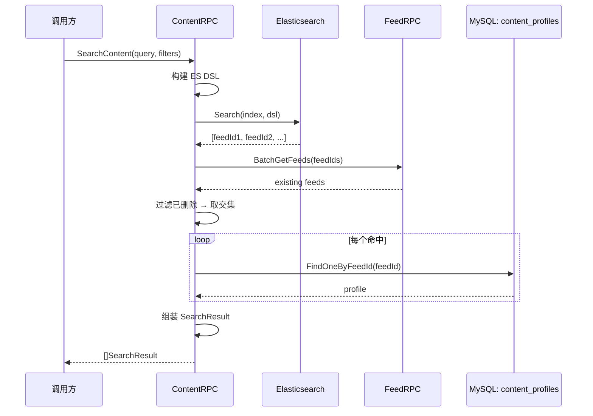
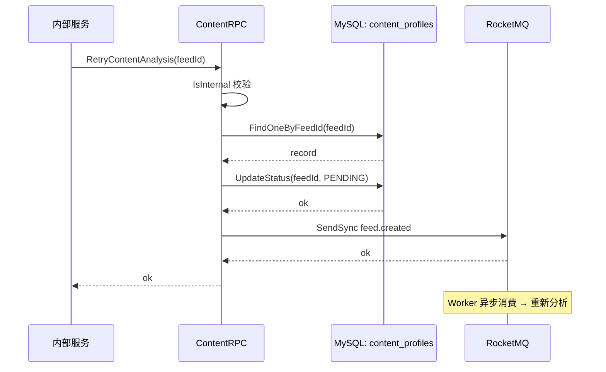
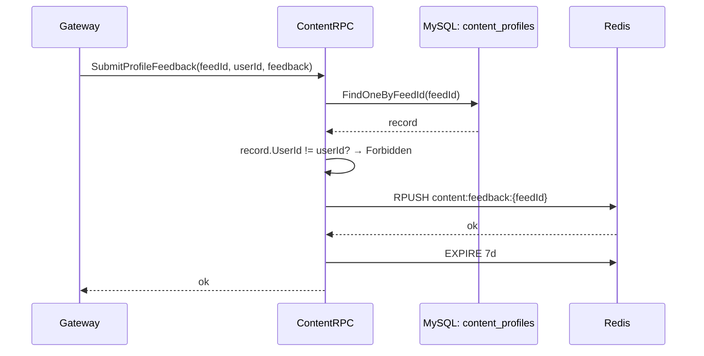

# Content 服务数据流

> 覆盖 `app/content/rpc/internal/logic/` 下全部 5 个 logic + 1 个 helper 的数据流说明。

---

## GetContentProfile

> 职责：按 feedId 查询内容画像——DB 查 record → 状态映射 → 权限判断 → 返回 pb。

### 1. 入口与前置

- 入口：gRPC `Content.GetContentProfile`
- 前置：无（调用方传入 viewerId 做权限判断）

### 2. 参数校验

| 校验点 | 内容 | 失败错误码 |
|--------|------|-----------|
| feedId | `<= 0` | `errorx.ParamError` |

### 3. 主流程

1. `Model.FindOneByFeedId(ctx, feedId)` MySQL 查 `content_profiles` 表
2. `statusMap[record.Status]` → pb 状态枚举（PENDING / ANALYZING / COMPLETED / FAILED）
3. if `record.Status != COMPLETED` → 直接返回状态 + 空画像
4. `contentHelper.profileToPB(record)` JSON 反序列化画像字段 → pb 结构
5. 权限检查：`viewerId == record.UserId` → 完整画像；否则按 `Visibility` 过滤

### 4. 依赖数据源清单

| 类型 | 名称 | 用途 | 关键说明 |
|------|------|------|----------|
| MySQL | `content_profiles.FindOneByFeedId` | 查记录 | — |
| helper | `contentHelper.profileToPB` | JSON→pb | 画像 JSON 反序列化 |

### 5. 失败与降级策略

| 失败点 | 策略 | 说明 |
|--------|------|------|
| 记录不存在 | 整体失败 | `errorx.ContentNotFound` |
| JSON 反序列化异常 | 降级 | 返回空画像 + COMPLETED 状态 |

### 6. 副作用

- 无。

### 7. 输出

- `pb.GetContentProfileResp`：`Status`、`Profile`（按权限筛选）、`CreatedAt`

### 8. 数据流图

---

## BatchGetContentProfile

> 职责：批量查询内容画像——逐个 FindOneByFeedId，仅返回 COMPLETED 的。

### 1. 入口与前置

- 入口：gRPC `Content.BatchGetContentProfile`
- 前置：无

### 2. 参数校验

| 校验点 | 内容 | 失败错误码 |
|--------|------|-----------|
| feedIds | 非空 | `errorx.ParamError` |

### 3. 主流程

1. `for feedId in feedIds`:
   - `FindOneByFeedId(feedId)` → nil 跳过（不计入结果）
   - `Status == COMPLETED` → `profileToPB` → 加入 results
   - 非 COMPLETED → 跳过

### 4. 依赖数据源清单

| 类型 | 名称 | 用途 | 关键说明 |
|------|------|------|----------|
| MySQL | `content_profiles.FindOneByFeedId` × N | 逐条查 | 不存在/非 COMPLETED 静默跳过 |
| helper | `profileToPB` | JSON→pb | — |

### 5. 失败与降级策略

| 失败点 | 策略 | 说明 |
|--------|------|------|
| 单条 FindOneByFeedId 失败 | 忽略 | 跳过，不影响其他 |
| 非 COMPLETED | 忽略 | 不纳入结果 |

### 6. 副作用

- 无。

### 7. 输出

- `pb.BatchGetContentProfileResp`：`map[feedId]*ContentProfile`，仅 COMPLETED 的。

### 8. 数据流图

---

## SearchContent

> 职责：结构化检索——ES 搜索 → FeedRPC 回查验证 → 过滤 → 组装结果。

### 1. 入口与前置

- 入口：gRPC `Content.SearchContent`
- 前置：无

### 2. 参数校验

| 校验点 | 内容 | 失败错误码 |
|--------|------|-----------|
| query | 非空 | `errorx.ParamError` |
| 筛选条件 | 合法性检查 | `errorx.ParamError` |

### 3. 主流程

1. 构建 ES DSL 查询（关键词 + 标签/分类/情感/时长等筛选器）
2. `ES.Search(ctx, index, dsl)` → 返回命中的 feedId 列表
3. `FeedRpc.BatchGetFeeds(feedIds)` 验证帖子存在性（过滤已删除）
4. 将 FeedRpc 结果与 ES 命中取交集 → 最终 feedIds
5. 对每个命中 feedId 取 `content_profiles` 画像 + 组装 `SearchResult`

### 4. 依赖数据源清单

| 类型 | 名称 | 用途 | 关键说明 |
|------|------|------|----------|
| ES | `ES.Search(index, dsl)` | 全文检索 | — |
| RPC | `FeedRpc.BatchGetFeeds` | 存在性验证 | 过滤已删除帖子 |
| MySQL | `content_profiles` 查询 | 组装画像 | — |

### 5. 失败与降级策略

| 失败点 | 策略 | 说明 |
|--------|------|------|
| ES 故障 | 整体失败 | 检索不可用 |
| FeedRpc 故障 | 降级 | 跳过验证，直接使用 ES 结果 |
| 单条画像缺失 | 忽略 | 返回基础信息 |

### 6. 副作用

- 无。

### 7. 输出

- `pb.SearchContentResp`：`[]SearchResult`，含 `FeedId`、`Profile`、`Score`

### 8. 数据流图

---

## RetryContentAnalysis

> 职责：重试内容分析——仅内部调用 → 重置状态为 PENDING → 重新入队 MQ。

### 1. 入口与前置

- 入口：gRPC `Content.RetryContentAnalysis`
- 前置：`IsInternal` 仅允许内部服务调用

### 2. 参数校验

| 校验点 | 内容 | 失败错误码 |
|--------|------|-----------|
| feedId | `<= 0` | `errorx.ParamError` |
| 调用方身份 | 非内部 | `errorx.Forbidden` |

### 3. 主流程

1. `FindOneByFeedId(feedId)` 确认记录存在
2. `UpdateStatus(feedId, PENDING)` 重置分析状态
3. `Producer.SendSync(ctx, feedCreatedTopic, payload)` 重新发送 MQ 事件，触发分析流程

### 4. 依赖数据源清单

| 类型 | 名称 | 用途 | 关键说明 |
|------|------|------|----------|
| MySQL | `content_profiles.FindOneByFeedId` | 确认存在 | — |
| MySQL | `content_profiles.UpdateStatus` | 重置为 PENDING | — |
| MQ | `feed.created` topic | 触发重新分析 | 同步发送 |

### 5. 失败与降级策略

| 失败点 | 策略 | 说明 |
|--------|------|------|
| 记录不存在 | 整体失败 | `errorx.ContentNotFound` |
| MQ 发送失败 | 整体失败 | 重试无意义 |

### 6. 副作用

- MQ：`feed.created` → Worker 消费后重新分析。

### 7. 输出

- `pb.RetryContentAnalysisResp`：确认消息

### 8. 数据流图

---

## SubmitProfileFeedback

> 职责：提交画像纠错反馈——校验所有权 → RPUSH Redis 列表 + 审计日志。

### 1. 入口与前置

- 入口：gRPC `Content.SubmitProfileFeedback`
- 前置：JWT 鉴权，传入 viewerId

### 2. 参数校验

| 校验点 | 内容 | 失败错误码 |
|--------|------|-----------|
| feedId | `<= 0` | `errorx.ParamError` |
| feedback | 非空 | `errorx.ParamError` |

### 3. 主流程

1. `FindOneByFeedId(feedId)` 确认记录存在
2. `record.UserId != userId` → `errorx.Forbidden`（仅作者可反馈）
3. `RPUSH content:feedback:{feedId} payload` 追加到 Redis 列表
4. `EXPIRE content:feedback:{feedId} 7*24*3600` 设 7 天 TTL
5. 写审计日志（可选）

### 4. 依赖数据源清单

| 类型 | 名称 | 用途 | 关键说明 |
|------|------|------|----------|
| MySQL | `content_profiles.FindOneByFeedId` | 确认存在+所有权 | — |
| Redis | `RPUSH content:feedback:{feedId}` | 追加反馈 | 7 天 TTL |

### 5. 失败与降级策略

| 失败点 | 策略 | 说明 |
|--------|------|------|
| 记录不存在 | 整体失败 | `errorx.ContentNotFound` |
| 非作者 | 整体失败 | `errorx.Forbidden` |
| Redis 写失败 | 降级 | 仅记日志，不阻塞 |

### 6. 副作用

- Redis 列表写入。

### 7. 输出

- `pb.SubmitProfileFeedbackResp`：确认消息

### 8. 数据流图

---

## 关联文档

- [内容分析](../agent/04-content-analysis.md)
- [内容检索](../agent/05-content-search.md)
- [Logic 数据流生成提示词](../../agent/logic-dataflow-guide.md)
