# Feed 服务数据流

> 覆盖 `app/feed/rpc/internal/logic/` 下全部 10 个 logic + 2 个 trace 辅助文件 + Feed Worker 的数据流说明。

---

## CreateFeed

> 职责：发帖——IsVip 判定 → Snowflake 发号 → MySQL 落库 → 异步 MQ（feed.created）→ Worker 写时间流/推荐池/同城池。

### 1. 入口与前置

- 入口：gRPC `Feed.CreateFeed`
- 前置：Gateway 已校验 JWT + COS 引用合规，传入 authorId + 媒体信息

### 2. 参数校验

| 校验点 | 内容 | 失败错误码 |
|--------|------|-----------|
| authorId | `<= 0` | `errorx.ParamError` |
| content / media | 至少一项非空 | `errorx.ParamError` |

### 3. 主流程

1. `RelationRpc.IsVip(authorId)` 判断是否大 V（决定推 outbox 还是 inbox）
2. `IdGen.Next()` 生成 Snowflake feedId
3. `Model.Insert(&feed{Id, AuthorId, Content, MediaUrls, CityCode, ...})` MySQL 落库
4. 异步 goroutine：`Producer.SendSync(feed.created, feedId, authorId, isVip, cityCode, ...)` MQ — **失败仅记日志不阻塞**

### 4. 依赖数据源清单

| 类型 | 名称 | 用途 | 关键说明 |
|------|------|------|----------|
| RPC | `RelationRpc.IsVip` | VIP 判定 | 决定推送策略 |
| MySQL | `feed.Insert` | 落库 | — |
| MQ | `feed.created` topic | 异步事件 | goroutine 发送，失败忽略 |
| 外部 | `IdGen` | Snowflake 发号 | — |

### 5. 失败与降级策略

| 失败点 | 策略 | 说明 |
|--------|------|------|
| IsVip 失败 | 降级 | 默认非 VIP（走 inbox 策略） |
| Insert 失败 | 整体失败 | — |
| MQ 发送失败 | 忽略 | 仅记日志；Worker 端有本地消息表兜底 |

### 6. 副作用

- MQ：`feed.created` → Feed Worker 消费 → 写 outbox（大V）/ inbox（普通用户）→ 推荐池 → 同城池

### 7. 输出

- `pb.CreateFeedResp`：`FeedId`

### 8. 数据流图

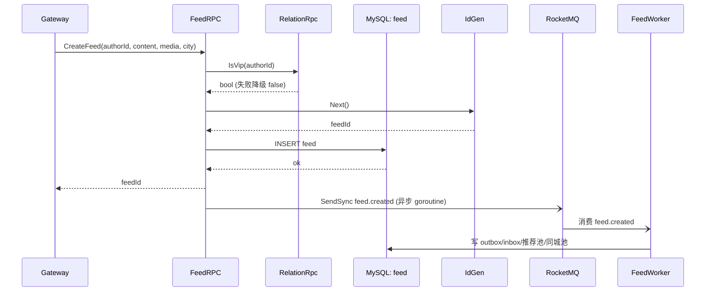

---

## DeleteFeed

> 职责：删帖——查 DB → 权限校验 → 软删除 → 异步 MQ（feed.deleted）。

### 1. 入口与前置

- 入口：gRPC `Feed.DeleteFeed`
- 前置：Gateway 已校验 JWT

### 2. 参数校验

| 校验点 | 内容 | 失败错误码 |
|--------|------|-----------|
| feedId | `<= 0` | `errorx.ParamError` |
| callerId | `<= 0` | `errorx.ParamError` |

### 3. 主流程

1. `Model.FindOne(ctx, feedId)` MySQL
2. `feed.AuthorId != callerId` → `errorx.Forbidden`
3. `Model.SoftDelete(ctx, feedId)` 软删
4. 异步：`Producer.SendSync(feed.deleted, feedId)` MQ

### 4. 依赖数据源清单

| 类型 | 名称 | 用途 | 关键说明 |
|------|------|------|----------|
| MySQL | `feed.FindOne` | 确权 | — |
| MySQL | `feed.SoftDelete` | 软删 | — |
| MQ | `feed.deleted` | 异步事件 | Worker 清理时间流/推荐池 |

### 5. 失败与降级策略

| 失败点 | 策略 | 说明 |
|--------|------|------|
| 帖子不存在 | 整体失败 | — |
| 非作者 | 整体失败 | `errorx.Forbidden` |
| MQ 发送失败 | 忽略 | 仅记日志 |

### 6. 副作用

- MQ：`feed.deleted` → Worker 从时间流/推荐池/同城池移除。

### 7. 输出

- `pb.DeleteFeedResp`：确认消息

### 8. 数据流图

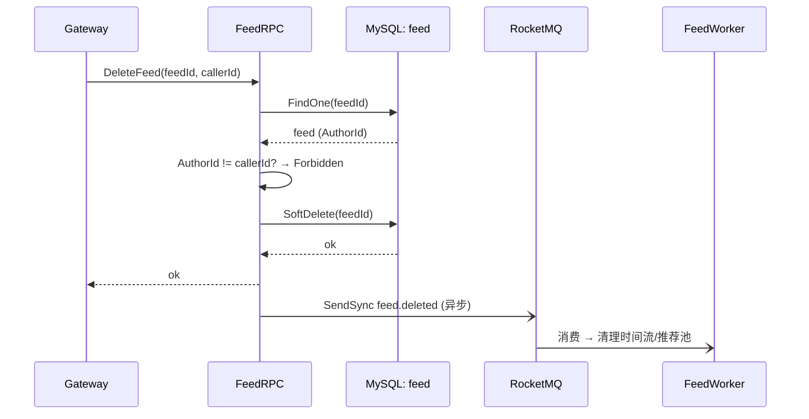

---

## GetFeed / GetFeedByCache

> 职责：单帖查询——Redis cache-aside（`feed:{id}`）→ 未命中回源 MySQL → 异步回写。

### 1. 入口与前置

- 入口：gRPC `Feed.GetFeed`
- 前置：无

### 2. 参数校验

| 校验点 | 内容 | 失败错误码 |
|--------|------|-----------|
| feedId | `<= 0` | `errorx.ParamError` |

### 3. 主流程

1. `GET feed:{feedId}` Redis → 命中返回
2. 未命中 → `Model.FindOne(ctx, feedId)` MySQL
3. 异步 goroutine：`SETEX feed:{feedId} ttl value` 回写

### 4. 依赖数据源清单

| 类型 | 名称 | 用途 | 关键说明 |
|------|------|------|----------|
| Redis | `GET feed:{feedId}` | 缓存 | — |
| MySQL | `feed.FindOne` | 回源 | — |
| Redis | `SETEX` | 异步回写 | 失败忽略 |

### 5. 失败与降级策略

| 失败点 | 策略 | 说明 |
|--------|------|------|
| 帖子不存在 | 整体失败 | `errorx.FeedNotFound` |
| Redis 故障 | 降级 | 直接 MySQL |
| SETEX 回写失败 | 忽略 | — |

### 6. 副作用

- 异步缓存回写。

### 7. 输出

- `pb.Feed`：feed 表全部字段

### 8. 数据流图

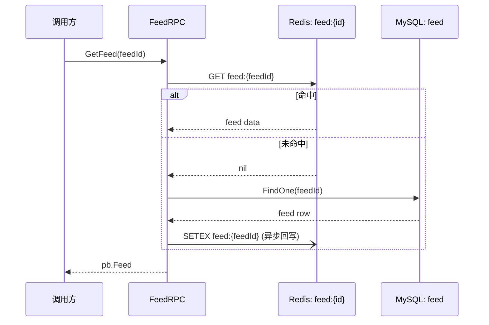

---

## BatchGetFeeds

> 职责：批量取帖——MySQL `WHERE id IN (...)`。

### 1. 入口与前置

- 入口：gRPC `Feed.BatchGetFeeds`
- 前置：无

### 2. 参数校验

| 校验点 | 内容 | 失败错误码 |
|--------|------|-----------|
| feedIds | 非空 | `errorx.ParamError` |

### 3. 主流程

1. `Model.FindByIds(ctx, feedIds)` MySQL IN 查询
2. 以 feedIds 原始顺序排列返回

### 4. 依赖数据源清单

| 类型 | 名称 | 用途 | 关键说明 |
|------|------|------|----------|
| MySQL | `feed.FindByIds` | IN 查询 | WHERE id IN (…) |

### 5. 失败与降级策略

| 失败点 | 策略 | 说明 |
|--------|------|------|
| DB 查询失败 | 整体失败 | — |
| 部分 id 不存在 | 忽略 | 仅返回存在的 |

### 6. 副作用

- 无。

### 7. 输出

- `pb.BatchGetFeedsResp`：`map[feedId]*Feed`

### 8. 数据流图

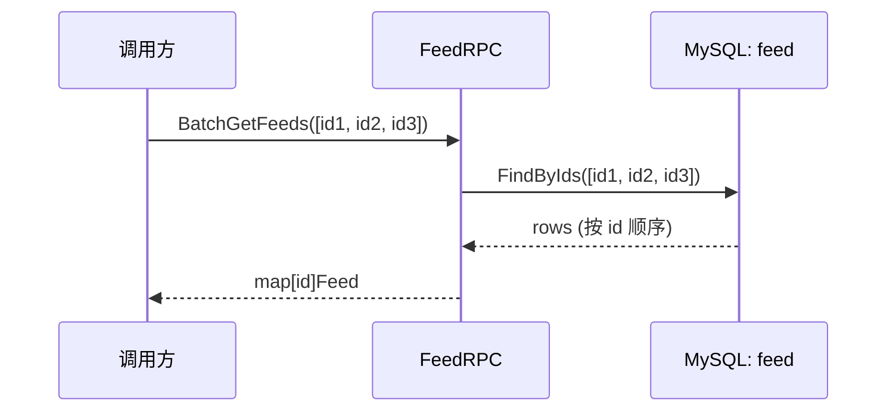

---

## GetUserFeeds

> 职责：用户主页帖子列表——MySQL 分页查询 `WHERE author_id=?`。

### 1. 入口与前置

- 入口：gRPC `Feed.GetUserFeeds`
- 前置：无

### 2. 参数校验

| 校验点 | 内容 | 失败错误码 |
|--------|------|-----------|
| userId | `<= 0` | `errorx.ParamError` |
| cursor/pageSize | 分页 | `errorx.ParamError` |

### 3. 主流程

1. `Model.FindByUserId(ctx, userId, cursor, pageSize)` MySQL `WHERE author_id=? ORDER BY id DESC LIMIT ?`

### 4. 依赖数据源清单

| 类型 | 名称 | 用途 | 关键说明 |
|------|------|------|----------|
| MySQL | `feed.FindByUserId` | 分页 | — |

### 5. 失败与降级策略

| 失败点 | 策略 | 说明 |
|--------|------|------|
| DB 故障 | 整体失败 | — |

### 6. 副作用

- 无。

### 7. 输出

- `pb.GetUserFeedsResp`：`[]Feed` + `nextCursor`

### 8. 数据流图

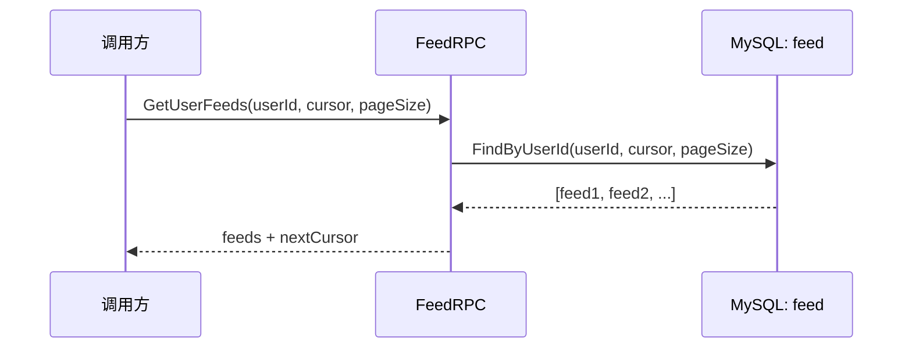

---

## GetCityTimeline

> 职责：同城时间流——`ZREVRANGEBYSCORE feed:city:{code}` 游标 → 批量取帖 → 异步写 trace。

### 1. 入口与前置

- 入口：gRPC `Feed.GetCityTimeline`
- 前置：无

### 2. 参数校验

| 校验点 | 内容 | 失败错误码 |
|--------|------|-----------|
| cityCode | 非空 | `errorx.ParamError` |
| cursor/pageSize | 分页 | `errorx.ParamError` |

### 3. 主流程

1. `ZREVRANGEBYSCORE feed:city:{cityCode} max cursor WITHSCORES LIMIT 0 pageSize` Redis
2. 命中 → `FindByIds(ctx, ids)` MySQL 取帖内容
3. 异步 goroutine：`trace.Write(feedTrace{requestId, feedIds, source:"city"})` 写入请求追踪

### 4. 依赖数据源清单

| 类型 | 名称 | 用途 | 关键说明 |
|------|------|------|----------|
| Redis | `ZREVRANGEBYSCORE feed:city:{cityCode}` | 同城池 | 创建时间流时写入 |
| MySQL | `feed.FindByIds` | 取帖内容 | — |
| 外部 | `trace.Writer` | 异步追踪 | goroutine，失败忽略 |

### 5. 失败与降级策略

| 失败点 | 策略 | 说明 |
|--------|------|------|
| Redis 故障 | 降级 | 回源 MySQL 按 city + 时间排序 |
| Trace 写失败 | 忽略 | 仅记日志 |

### 6. 副作用

- 异步 trace 写入（用于推荐/debug）。

### 7. 输出

- `pb.TimelineResp`：`[]Feed` + `nextCursor`

### 8. 数据流图

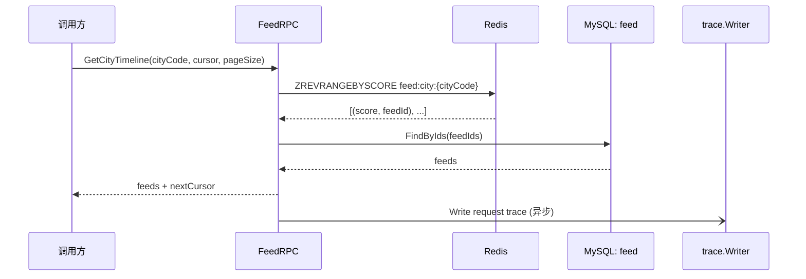

---

## GetRecommendTimeline

> 职责：推荐时间流——`ZREVRANGEBYSCORE feed:recommend` 游标 → 批量取帖 → 异步 trace。

### 1. 入口与前置

- 入口：gRPC `Feed.GetRecommendTimeline`
- 前置：无

### 2. 参数校验

同城市流（cursor/pageSize）。

### 3. 主流程

1. `ZREVRANGEBYSCORE feed:recommend max cursor WITHSCORES LIMIT 0 pageSize` Redis
2. `FindByIds(ctx, ids)` MySQL
3. 异步 trace write

### 4. 依赖数据源清单

| 类型 | 名称 | 用途 | 关键说明 |
|------|------|------|----------|
| Redis | `ZREVRANGEBYSCORE feed:recommend` | 推荐池 | — |
| MySQL | `feed.FindByIds` | 取内容 | — |
| 外部 | `trace.Writer` | 异步追踪 | — |

### 5. 失败与降级策略

同城市流。

### 6. 副作用

- 异步 trace。

### 7. 输出

- `pb.TimelineResp`

### 8. 数据流图

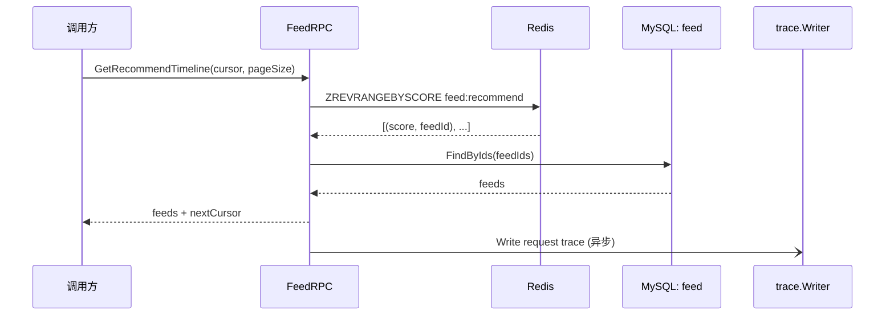

---

## GetFollowTimeline

> 职责：关注时间流（推拉结合）——inbox ZREVRANGEBYSCORE → 空？重建 inbox（合并关注列表+大V outbox）→ FindByIds → 异步 trace。

### 1. 入口与前置

- 入口：gRPC `Feed.GetFollowTimeline`
- 前置：无（调用方传入 viewerId）

### 2. 参数校验

| 校验点 | 内容 | 失败错误码 |
|--------|------|-----------|
| userId | `<= 0` | `errorx.ParamError` |
| cursor/pageSize | 分页 | `errorx.ParamError` |

### 3. 主流程

1. `ZREVRANGEBYSCORE inbox:{userId} max cursor WITHSCORES LIMIT 0 pageSize` Redis
2. 命中 → Step 5
3. **未命中 → 重建 inbox**：
   a. `RelationRpc.GetFollows(userId)` 获取关注列表
   b. `RelationRpc.BatchIsVip(followeeIds)` 批量判定大 V
   c. 普通用户帖子 → 已在 inbox 中（创建时 Worker 推送）
   d. 大 V `for bigV in bigVs`：`ZREVRANGEBYSCORE outbox:{bigV} max cursor` 拉取 outbox
   e. 合并 inbox 残余 + outbox → `ZADD inbox:{userId}` 写入并排序
4. 再次 `ZREVRANGEBYSCORE inbox:{userId}` 取值
5. `FindByIds(ctx, ids)` MySQL 取帖内容
6. 异步 trace write

### 4. 依赖数据源清单

| 类型 | 名称 | 用途 | 关键说明 |
|------|------|------|----------|
| Redis | `ZREVRANGEBYSCORE inbox:{userId}` | 关注流主源 | 推拉结合 |
| Redis | `ZREVRANGEBYSCORE outbox:{bigV}` | 大V时间线 | 按需拉取 |
| Redis | `ZADD inbox:{userId}` | 重建合并 | — |
| RPC | `RelationRpc.GetFollows` | 关注列表 | — |
| RPC | `RelationRpc.BatchIsVip` | 大V判定 | — |
| MySQL | `feed.FindByIds` | 取帖内容 | — |
| 外部 | `trace.Writer` | 异步追踪 | — |

### 5. 失败与降级策略

| 失败点 | 策略 | 说明 |
|--------|------|------|
| Redis 故障 | 降级 | 直接 MySQL 按时间全局排序（低效但可用） |
| GetFollows/BatchIsVip 失败 | 降级 | 仅使用 inbox 已有数据 |
| outbox 拉取失败 | 降级 | 跳过该大 V |
| Trace 写失败 | 忽略 | — |

### 6. 副作用

- 异步 trace write；
- 可能重建 inbox（ZADD）。

### 7. 输出

- `pb.TimelineResp`

### 8. 数据流图

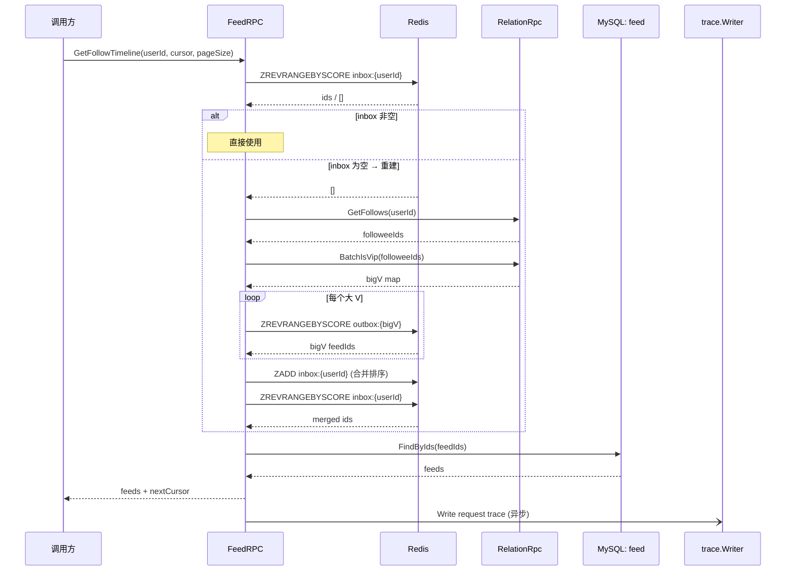

---

## GetFeedRequestTrace / GetFeedSource

> 职责：请求追踪——读 Redis trace 记录，反序列化后校验所有权/定位来源。

### 1. 入口与前置

- 入口：gRPC `Feed.GetFeedRequestTrace` / `Feed.GetFeedSource`
- 前置：无

### 2. 参数校验

| 校验点 | 内容 | 失败错误码 |
|--------|------|-----------|
| requestId / feedId | 非空 | `errorx.ParamError` |

### 3. 主流程

**GetFeedRequestTrace**:
1. `HGET feed:trace:{requestId}` 取整条 trace 记录
2. JSON 反序列化 → `FeedRequestTrace`
3. `trace.UserId != viewerId` → `errorx.Forbidden`（仅本人可查）

**GetFeedSource**:
1. 通过 callerId 推导 traceUserId
2. `HGET feed:trace:{requestId} f:{feedId}` 取该帖在当次请求中的排名/来源

### 4. 依赖数据源清单

| 类型 | 名称 | 用途 | 关键说明 |
|------|------|------|----------|
| Redis | `HGET feed:trace:{requestId}` | trace 存储 | Hash 结构 |

### 5. 失败与降级策略

| 失败点 | 策略 | 说明 |
|--------|------|------|
| trace 不存在 | 整体失败 | — |
| 非本人 | 整体失败 | `errorx.Forbidden` |

### 6. 副作用

- 无。

### 7. 输出

- `pb.*TraceResp`

### 8. 数据流图

**GetFeedRequestTrace**:

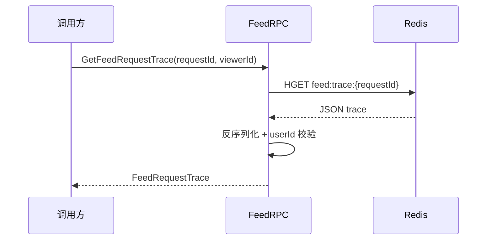

**GetFeedSource**:

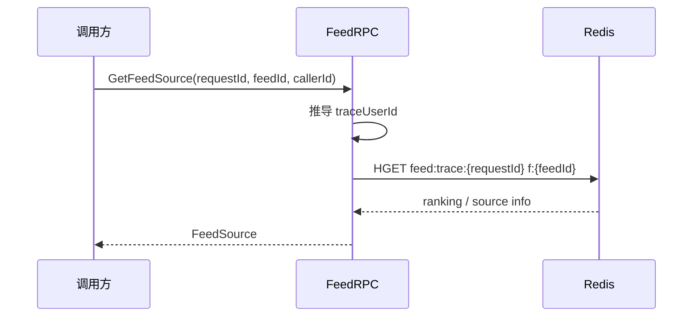

---

## Feed Worker

> 职责：消费 MQ 事件完成异步副作用——写时间流/推荐池/同城池/评论计数镜像。

### 1. 入口与前置

- 入口：异步消费 RocketMQ topic
- 前置：无

### 2. 消费的事件

| Topic | 处理动作 |
|-------|---------|
| `feed.created` | 若大 V → `ZADD outbox:{authorId}`；普通用户 → `ZADD inbox:{followerId}` 推给所有粉丝；同时 `ZADD feed:recommend` + `ZADD feed:city:{code}` |
| `feed.deleted` | `ZREM inbox:{followerId}`、`ZREM outbox:{authorId}`、`ZREM feed:recommend`、`ZREM feed:city:{code}` |
| `comment.created` | 更新 feed 表 `comment_count` 镜像列 |
| `comment.deleted` | 更新 feed 表 `comment_count` 镜像列（减量） |

### 3. 主流程

**handleFeedCreate**:
1. 若 `isVip` → `ZADD outbox:{authorId} score feedId`
2. 取 `GetFans(authorId)` 粉丝列表
3. Pipeline `ZADD inbox:{followerId} score feedId` 推送给所有粉丝
4. `ZADD feed:recommend score feedId`
5. 若 `cityCode != ""` → `ZADD feed:city:{cityCode} score feedId`

**handleFeedDelete**:
1. `ZREM inbox:{*}`、outbox、recommend、city 中移除 feedId

**handleCommentEvent**:
1. `UPDATE feed SET comment_count = comment_count +/- 1 WHERE id = feedId`

### 4. 依赖数据源清单

| 类型 | 名称 | 用途 | 关键说明 |
|------|------|------|----------|
| MQ | `feed.created/deleted/comment.*` | 事件源 | — |
| Redis | `ZADD/ZREM outbox:{id}` | 大 V 时间线 | — |
| Redis | `ZADD/ZREM inbox:{id}` | 粉丝 inbox 推送 | Pipeline 批量 |
| Redis | `ZADD/ZREM feed:recommend` | 推荐池 | — |
| Redis | `ZADD/ZREM feed:city:{code}` | 同城池 | — |
| MySQL | `feed.Update` | 评论计数镜像 | 增量更新 |

### 5. 失败与降级策略

| 失败点 | 策略 | 说明 |
|--------|------|------|
| Redis Pipeline 部分失败 | 重试 | 单条失败跳过，下轮心跳补齐 |
| comment_count 增量 | 幂等 | UPDATE ... + 1 可重复执行 |

### 6. 副作用

- Redis 时间流/推荐池/同城池的写入或清理。
- MySQL feed 镜像计数列更新。

### 7. 输出

- 无（异步消费，无返回值）。

### 8. 数据流图

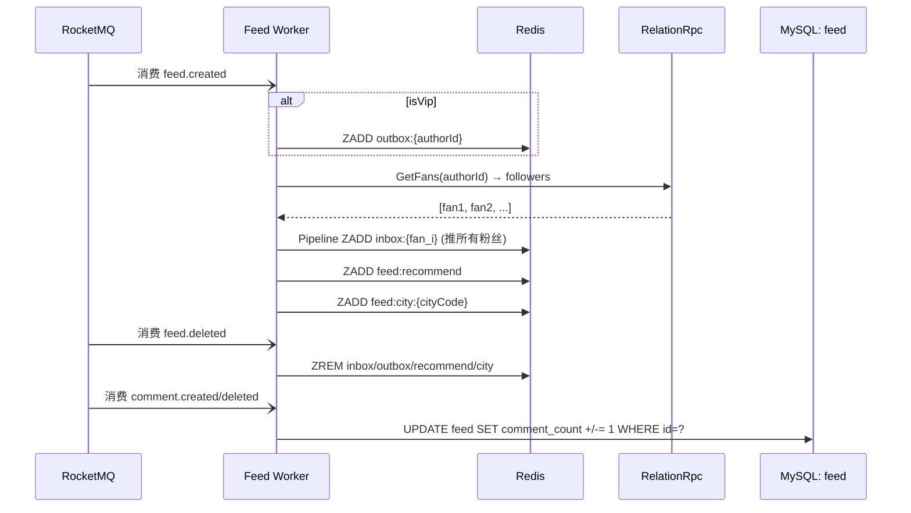

---

## 关联文档

- [Feed 设计总览](./README.md)
- [数据模型](./01-data-model/01-data-model.md)
- [发帖流程](./02-post-publish.md)
- [时间流设计](./03-timeline/03-timeline.md)
- [Logic 数据流生成提示词](../../agent/logic-dataflow-guide.md)
