# Gateway 服务数据流

> 覆盖 `app/gateway/internal/logic/` 下全部 BFF 聚合逻辑（顶层 9 + feed/ 8 + comment/ 6 + interaction/ 6 + relation/ 5 + aggregate/ 1 helper）的数据流说明。
>
> Gateway 通用模式：`JWT 鉴权 → 参数校验 → 调下游 RPC → COS 签名/字段映射 → 组装响应`。

---

## 顶层 Logic（用户/认证/COS）

### Login / Register

> 职责：登录/注册 BFF——调 UserRpc → userInfo 映射 → 返回 token+user。

**数据流图**:

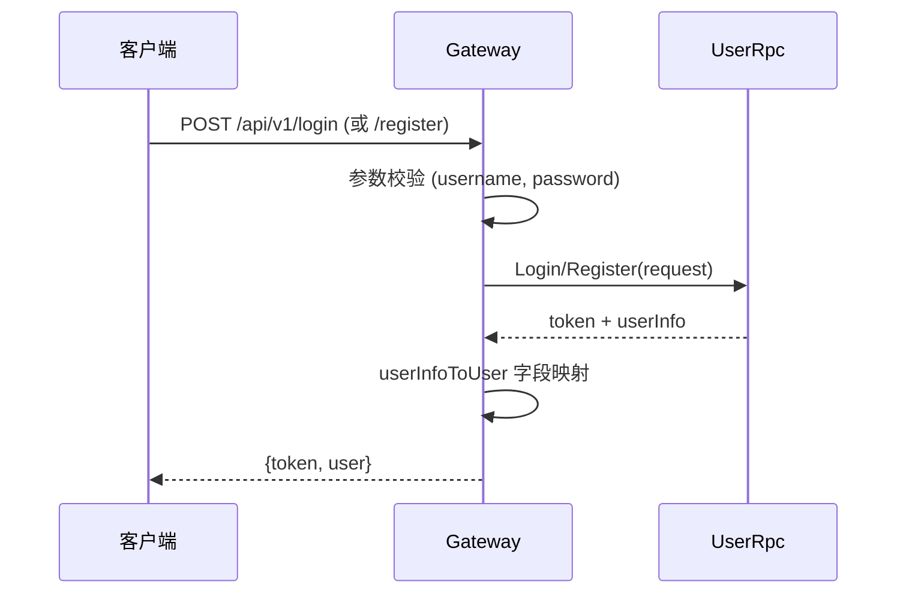
```mermaid
sequenceDiagram
    participant Client as 客户端
    participant GW as Gateway
    participant U as UserRpc

    Client->>GW: POST /api/v1/login (或 /register)
    GW->>GW: 参数校验 (username, password)
    GW->>U: Login/Register(request)
    U-->>GW: token + userInfo
    GW->>GW: userInfoToUser 字段映射
    GW-->>Client: {token, user}
```

### GetMe

> 职责：我的信息——调 UserRpc.GetUser + 详细映射。

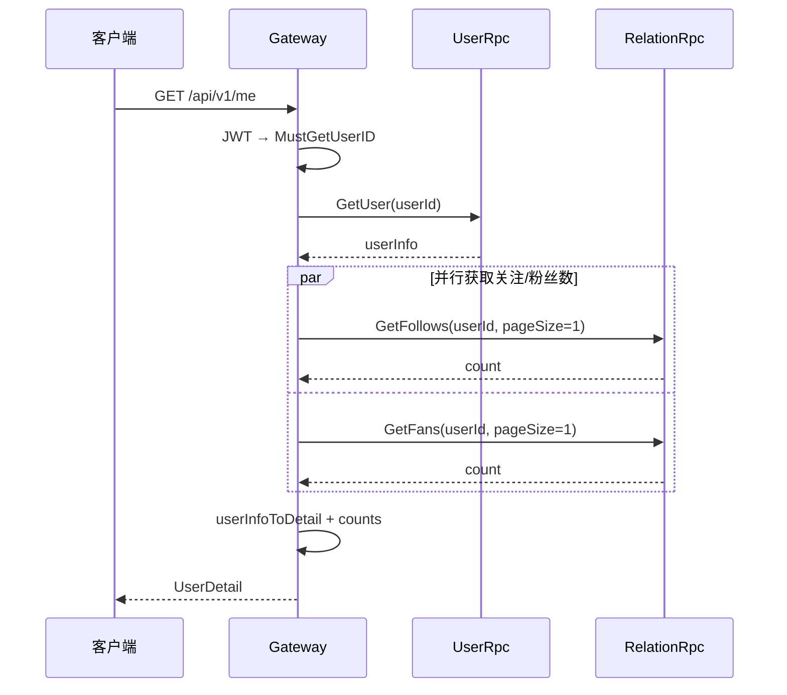
```mermaid
sequenceDiagram
    participant Client as 客户端
    participant GW as Gateway
    participant U as UserRpc
    participant Rel as RelationRpc

    Client->>GW: GET /api/v1/me
    GW->>GW: JWT → MustGetUserID
    GW->>U: GetUser(userId)
    U-->>GW: userInfo
    par 并行获取关注/粉丝数
        GW->>Rel: GetFollows(userId, pageSize=1)
        Rel-->>GW: count
    and
        GW->>Rel: GetFans(userId, pageSize=1)
        Rel-->>GW: count
    end
    GW->>GW: userInfoToDetail + counts
    GW-->>Client: UserDetail
```

### GetUser

> 职责：查看他人主页——并行取用户信息 + 关注状态 + 关注/粉丝数。

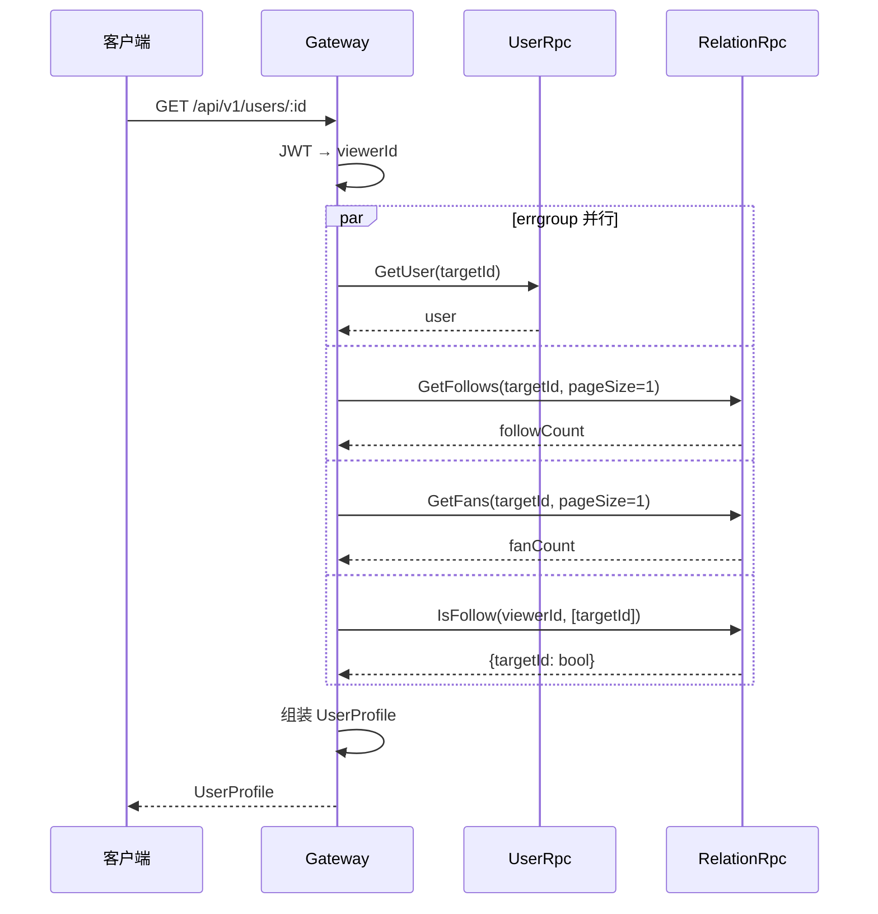
```mermaid
sequenceDiagram
    participant Client as 客户端
    participant GW as Gateway
    participant U as UserRpc
    participant Rel as RelationRpc

    Client->>GW: GET /api/v1/users/:id
    GW->>GW: JWT → viewerId
    par errgroup 并行
        GW->>U: GetUser(targetId)
        U-->>GW: user
    and
        GW->>Rel: GetFollows(targetId, pageSize=1)
        Rel-->>GW: followCount
    and
        GW->>Rel: GetFans(targetId, pageSize=1)
        Rel-->>GW: fanCount
    and
        GW->>Rel: IsFollow(viewerId, [targetId])
        Rel-->>GW: {targetId: bool}
    end
    GW->>GW: 组装 UserProfile
    GW-->>Client: UserProfile
```

### UpdateMe

> 职责：编辑个人信息——`CanonicalizeCosRef` 规范化 COS 引用 → UserRpc.UpdateUser。

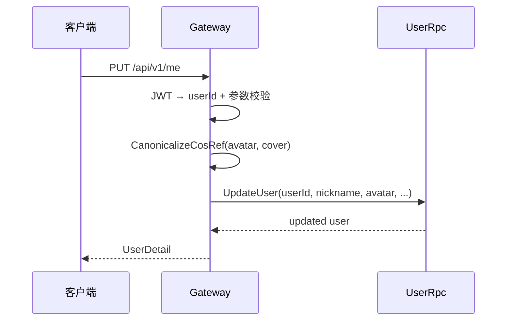
```mermaid
sequenceDiagram
    participant Client as 客户端
    participant GW as Gateway
    participant U as UserRpc

    Client->>GW: PUT /api/v1/me
    GW->>GW: JWT → userId + 参数校验
    GW->>GW: CanonicalizeCosRef(avatar, cover)
    GW->>U: UpdateUser(userId, nickname, avatar, ...)
    U-->>GW: updated user
    GW-->>Client: UserDetail
```

### UploadToken

> 职责：获取 COS 上传凭证——`Cos.Issue(ctx, userId)` 签发 STS 临时凭证。

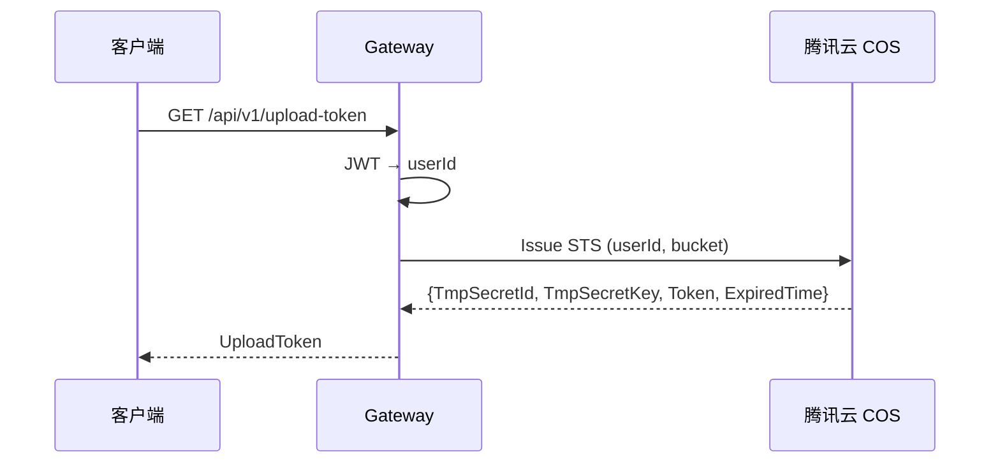
```mermaid
sequenceDiagram
    participant Client as 客户端
    participant GW as Gateway
    participant COS as 腾讯云 COS

    Client->>GW: GET /api/v1/upload-token
    GW->>GW: JWT → userId
    GW->>COS: Issue STS (userId, bucket)
    COS-->>GW: {TmpSecretId, TmpSecretKey, Token, ExpiredTime}
    GW-->>Client: UploadToken
```

### SignUrl

> 职责：COS 私有桶签名——`ownsFileKey(key, userId)` 确权 → `Cos.SignGet(ctx, key)`。

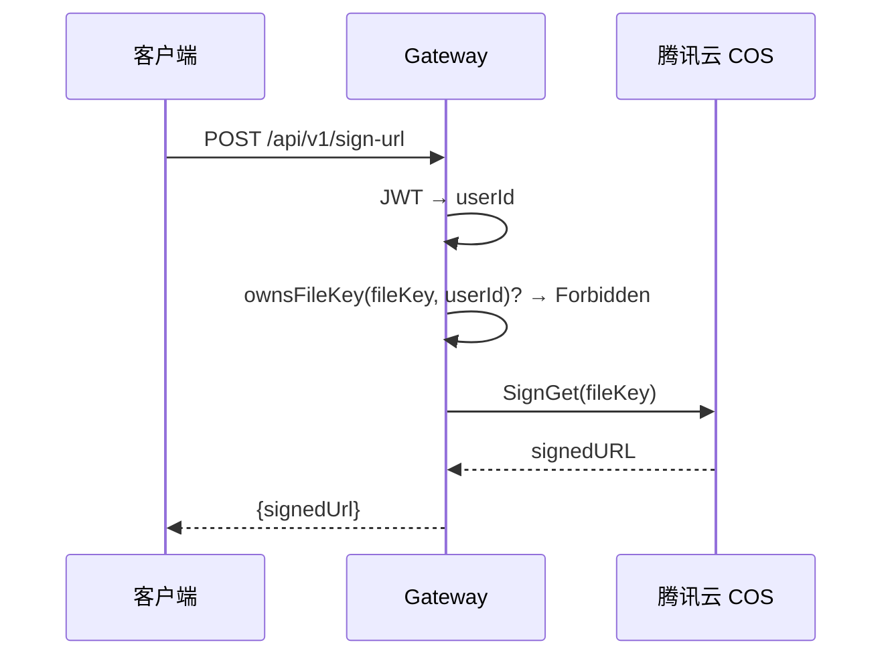
```mermaid
sequenceDiagram
    participant Client as 客户端
    participant GW as Gateway
    participant COS as 腾讯云 COS

    Client->>GW: POST /api/v1/sign-url
    GW->>GW: JWT → userId
    GW->>GW: ownsFileKey(fileKey, userId)? → Forbidden
    GW->>COS: SignGet(fileKey)
    COS-->>GW: signedURL
    GW-->>Client: {signedUrl}
```

---

## Feed 子模块

### CreateFeed

> 职责：发帖——IP 解析 → `CanonicalizeCosRef` 规范化 → FeedRpc.CreateFeed → `SignCosRef` 签名返回。

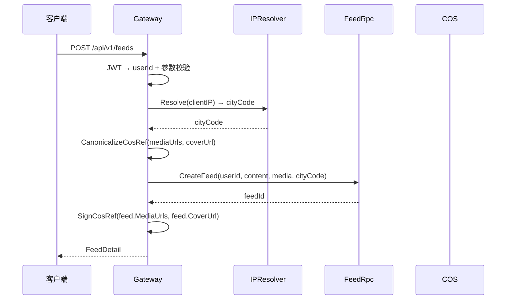
```mermaid
sequenceDiagram
    participant Client as 客户端
    participant GW as Gateway
    participant IP as IPResolver
    participant F as FeedRpc
    participant COS as COS

    Client->>GW: POST /api/v1/feeds
    GW->>GW: JWT → userId + 参数校验
    GW->>IP: Resolve(clientIP) → cityCode
    IP-->>GW: cityCode
    GW->>GW: CanonicalizeCosRef(mediaUrls, coverUrl)
    GW->>F: CreateFeed(userId, content, media, cityCode)
    F-->>GW: feedId
    GW->>GW: SignCosRef(feed.MediaUrls, feed.CoverUrl)
    GW-->>Client: FeedDetail
```

### DeleteFeed

> 职责：删帖——FeedRpc.GetFeed 确权 → FeedRpc.DeleteFeed。

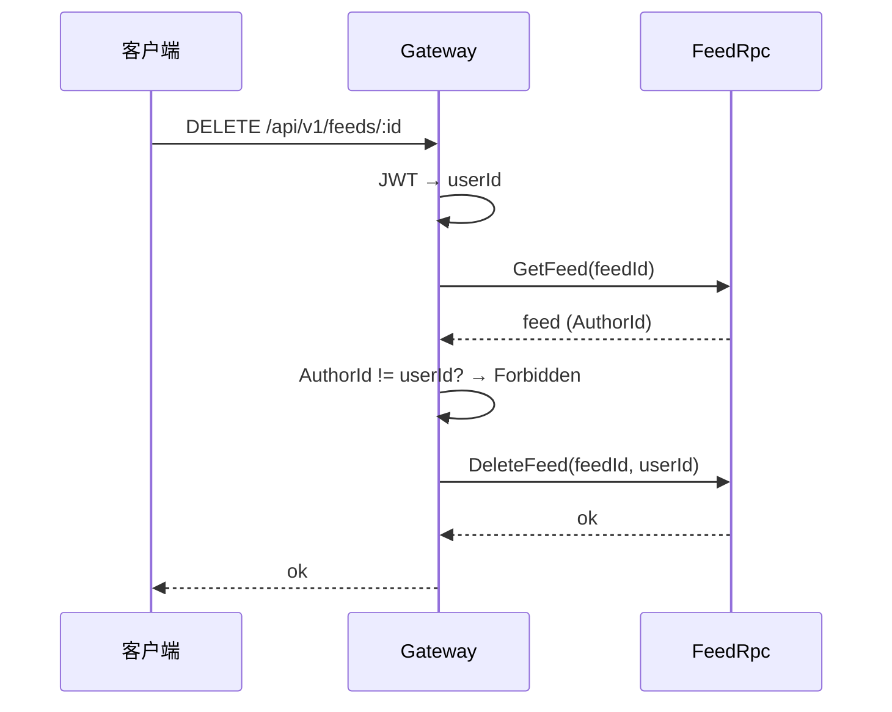
```mermaid
sequenceDiagram
    participant Client as 客户端
    participant GW as Gateway
    participant F as FeedRpc

    Client->>GW: DELETE /api/v1/feeds/:id
    GW->>GW: JWT → userId
    GW->>F: GetFeed(feedId)
    F-->>GW: feed (AuthorId)
    GW->>GW: AuthorId != userId? → Forbidden
    GW->>F: DeleteFeed(feedId, userId)
    F-->>GW: ok
    GW-->>Client: ok
```

### GetFeedDetail

> 职责：帖子详情 BFF——取帖子基础数据 → errgroup 并行聚合作者/关注/互动/评论数。

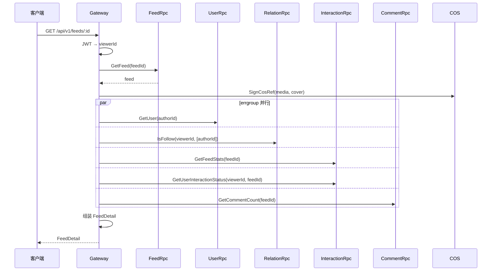
```mermaid
sequenceDiagram
    participant Client as 客户端
    participant GW as Gateway
    participant F as FeedRpc
    participant U as UserRpc
    participant Rel as RelationRpc
    participant I as InteractionRpc
    participant C as CommentRpc
    participant COS as COS

    Client->>GW: GET /api/v1/feeds/:id
    GW->>GW: JWT → viewerId
    GW->>F: GetFeed(feedId)
    F-->>GW: feed
    GW->>COS: SignCosRef(media, cover)
    par errgroup 并行
        GW->>U: GetUser(authorId)
    and
        GW->>Rel: IsFollow(viewerId, [authorId])
    and
        GW->>I: GetFeedStats(feedId)
    and
        GW->>I: GetUserInteractionStatus(viewerId, feedId)
    and
        GW->>C: GetCommentCount(feedId)
    end
    GW->>GW: 组装 FeedDetail
    GW-->>Client: FeedDetail
```

### Timeline（推荐/关注/同城）

> 职责：时间流聚合——按 tab 路由到不同 RPC → `BuildFeedCards` 批量聚合。

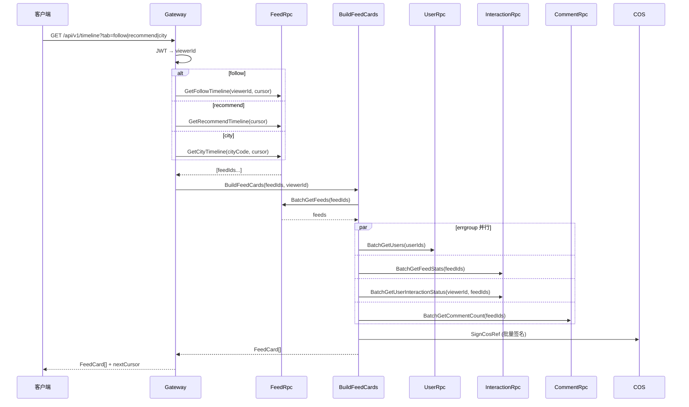
```mermaid
sequenceDiagram
    participant Client as 客户端
    participant GW as Gateway
    participant F as FeedRpc
    participant Agg as BuildFeedCards
    participant U as UserRpc
    participant I as InteractionRpc
    participant C as CommentRpc
    participant COS as COS

    Client->>GW: GET /api/v1/timeline?tab=follow|recommend|city
    GW->>GW: JWT → viewerId
    alt follow
        GW->>F: GetFollowTimeline(viewerId, cursor)
    else recommend
        GW->>F: GetRecommendTimeline(cursor)
    else city
        GW->>F: GetCityTimeline(cityCode, cursor)
    end
    F-->>GW: [feedIds...]
    GW->>Agg: BuildFeedCards(feedIds, viewerId)
    Agg->>F: BatchGetFeeds(feedIds)
    F-->>Agg: feeds
    par errgroup 并行
        Agg->>U: BatchGetUsers(userIds)
    and
        Agg->>I: BatchGetFeedStats(feedIds)
    and
        Agg->>I: BatchGetUserInteractionStatus(viewerId, feedIds)
    and
        Agg->>C: BatchGetCommentCount(feedIds)
    end
    Agg->>COS: SignCosRef (批量签名)
    Agg-->>GW: FeedCard[]
    GW-->>Client: FeedCard[] + nextCursor
```

### UserFeeds

> 职责：用户主页帖子列表 → BuildFeedCards。

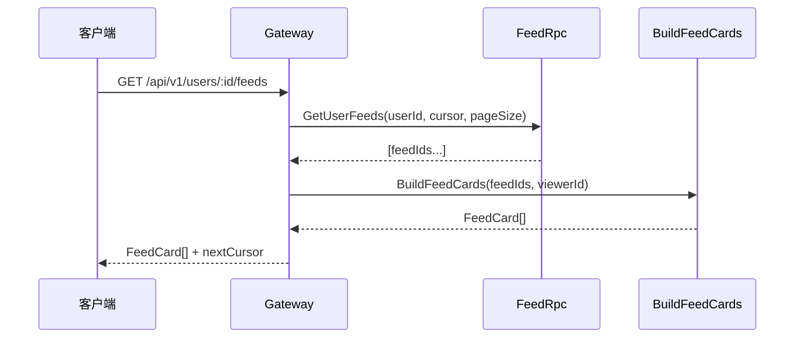
```mermaid
sequenceDiagram
    participant Client as 客户端
    participant GW as Gateway
    participant F as FeedRpc
    participant Agg as BuildFeedCards

    Client->>GW: GET /api/v1/users/:id/feeds
    GW->>F: GetUserFeeds(userId, cursor, pageSize)
    F-->>GW: [feedIds...]
    GW->>Agg: BuildFeedCards(feedIds, viewerId)
    Agg-->>GW: FeedCard[]
    GW-->>Client: FeedCard[] + nextCursor
```

### ContentProfile / ContentFeedback

> 职责：内容画像透传——直接转发 ContentRpc。

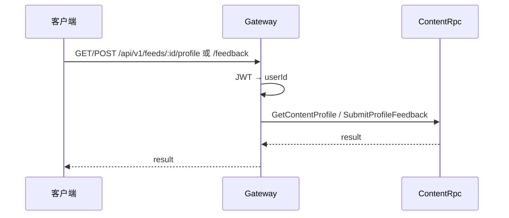
```mermaid
sequenceDiagram
    participant Client as 客户端
    participant GW as Gateway
    participant C as ContentRpc

    Client->>GW: GET/POST /api/v1/feeds/:id/profile 或 /feedback
    GW->>GW: JWT → userId
    GW->>C: GetContentProfile / SubmitProfileFeedback
    C-->>GW: result
    GW-->>Client: result
```

### CreatorMetrics

> 职责：创作者指标——直接转发 InteractionRpc。

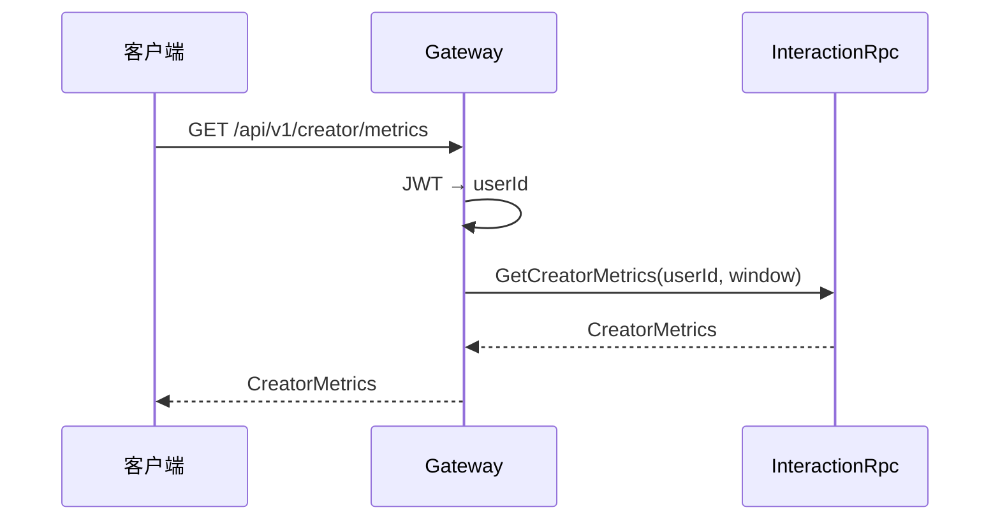
```mermaid
sequenceDiagram
    participant Client as 客户端
    participant GW as Gateway
    participant I as InteractionRpc

    Client->>GW: GET /api/v1/creator/metrics
    GW->>GW: JWT → userId
    GW->>I: GetCreatorMetrics(userId, window)
    I-->>GW: CreatorMetrics
    GW-->>Client: CreatorMetrics
```

### ReportBehaviors

> 职责：埋点上报——校验 + 限流 → BatchGetFeeds 验证 → 逐条发 MQ。

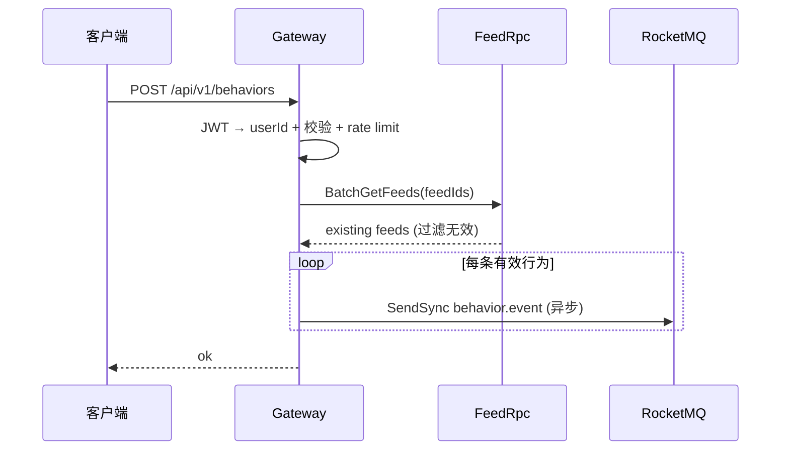
```mermaid
sequenceDiagram
    participant Client as 客户端
    participant GW as Gateway
    participant F as FeedRpc
    participant MQ as RocketMQ

    Client->>GW: POST /api/v1/behaviors
    GW->>GW: JWT → userId + 校验 + rate limit
    GW->>F: BatchGetFeeds(feedIds)
    F-->>GW: existing feeds (过滤无效)
    loop 每条有效行为
        GW->>MQ: SendSync behavior.event (异步)
    end
    GW-->>Client: ok
```

---

## Comment 子模块

### CreateComment / DeleteComment

> 职责：发表/删除评论——转发 CommentRpc + 补偿用户信息。

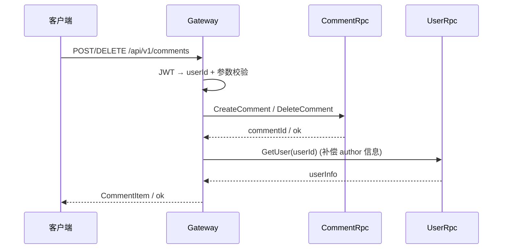
```mermaid
sequenceDiagram
    participant Client as 客户端
    participant GW as Gateway
    participant C as CommentRpc
    participant U as UserRpc

    Client->>GW: POST/DELETE /api/v1/comments
    GW->>GW: JWT → userId + 参数校验
    GW->>C: CreateComment / DeleteComment
    C-->>GW: commentId / ok
    GW->>U: GetUser(userId) (补偿 author 信息)
    U-->>GW: userInfo
    GW-->>Client: CommentItem / ok
```

### ListComments / ListReplies

> 职责：评论/回复列表——errgroup 并行取列表 + 热门 + 用户。

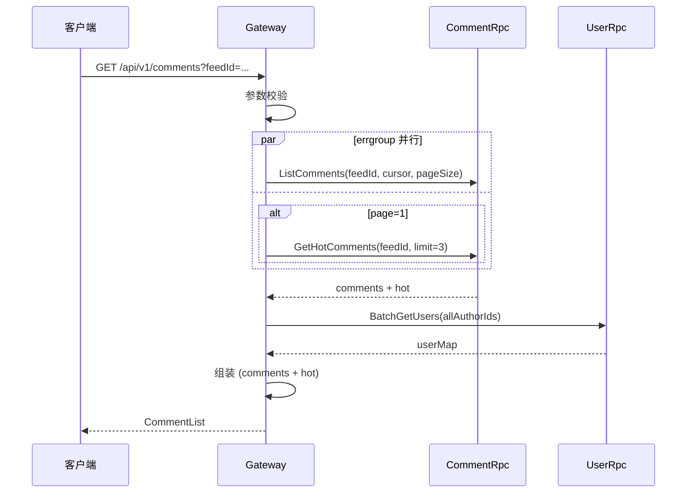
```mermaid
sequenceDiagram
    participant Client as 客户端
    participant GW as Gateway
    participant C as CommentRpc
    participant U as UserRpc

    Client->>GW: GET /api/v1/comments?feedId=...
    GW->>GW: 参数校验
    par errgroup 并行
        GW->>C: ListComments(feedId, cursor, pageSize)
    and
        alt page=1
            GW->>C: GetHotComments(feedId, limit=3)
        end
    end
    C-->>GW: comments + hot
    GW->>U: BatchGetUsers(allAuthorIds)
    U-->>GW: userMap
    GW->>GW: 组装 (comments + hot)
    GW-->>Client: CommentList
```

### LikeComment / UnlikeComment

> 职责：评论点赞/取消赞——**当前为占位**（直接返回错误，reason:"not implemented"）。

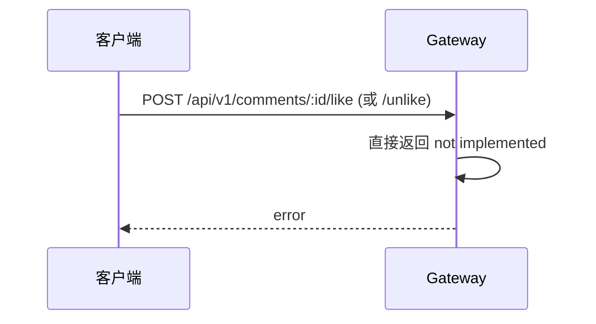
```mermaid
sequenceDiagram
    participant Client as 客户端
    participant GW as Gateway

    Client->>GW: POST /api/v1/comments/:id/like (或 /unlike)
    GW->>GW: 直接返回 not implemented
    GW-->>Client: error
```

---

## Interaction 子模块

### LikeFeed / UnlikeFeed / CollectFeed / UncollectFeed

> 职责：点赞/收藏操作——转发 InteractionRpc → 读回最新统计。

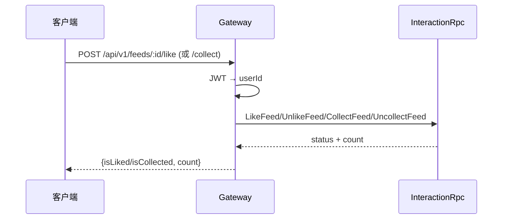
```mermaid
sequenceDiagram
    participant Client as 客户端
    participant GW as Gateway
    participant I as InteractionRpc

    Client->>GW: POST /api/v1/feeds/:id/like (或 /collect)
    GW->>GW: JWT → userId
    GW->>I: LikeFeed/UnlikeFeed/CollectFeed/UncollectFeed
    I-->>GW: status + count
    GW-->>Client: {isLiked/isCollected, count}
```

### MyLikes / MyCollects

> 职责：我的赞/收藏列表——RPC 取 feedIds → BuildFeedCards。

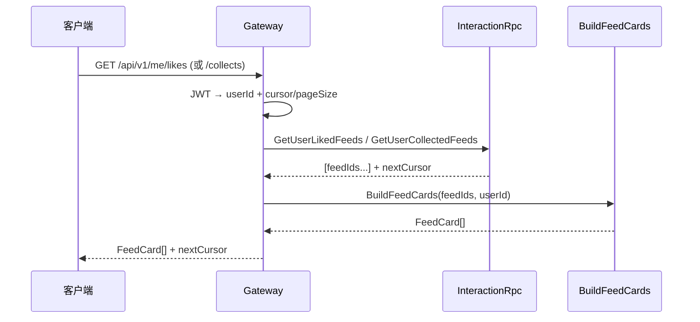
```mermaid
sequenceDiagram
    participant Client as 客户端
    participant GW as Gateway
    participant I as InteractionRpc
    participant Agg as BuildFeedCards

    Client->>GW: GET /api/v1/me/likes (或 /collects)
    GW->>GW: JWT → userId + cursor/pageSize
    GW->>I: GetUserLikedFeeds / GetUserCollectedFeeds
    I-->>GW: [feedIds...] + nextCursor
    GW->>Agg: BuildFeedCards(feedIds, userId)
    Agg-->>GW: FeedCard[]
    GW-->>Client: FeedCard[] + nextCursor
```

---

## Relation 子模块

### Follow / Unfollow

> 职责：关注/取关——转发 RelationRpc → 读回最新粉丝数。

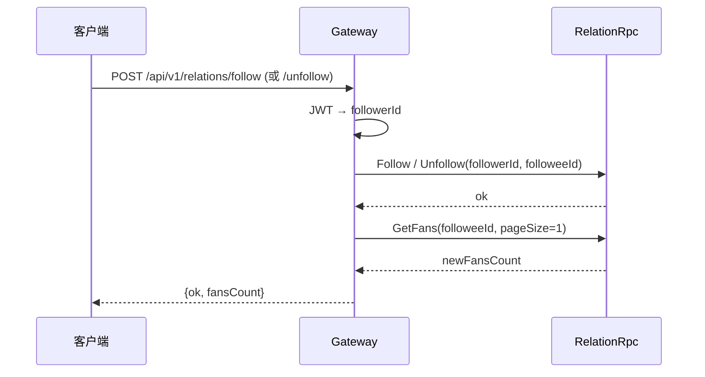
```mermaid
sequenceDiagram
    participant Client as 客户端
    participant GW as Gateway
    participant Rel as RelationRpc

    Client->>GW: POST /api/v1/relations/follow (或 /unfollow)
    GW->>GW: JWT → followerId
    GW->>Rel: Follow / Unfollow(followerId, followeeId)
    Rel-->>GW: ok
    GW->>Rel: GetFans(followeeId, pageSize=1)
    Rel-->>GW: newFansCount
    GW-->>Client: {ok, fansCount}
```

### FollowingList / FollowerList

> 职责：关注/粉丝列表——RPC 取 ids → BatchGetUsers + IsFollow。

```mermaid
sequenceDiagram
    participant Client as 客户端
    participant GW as Gateway
    participant Rel as RelationRpc
    participant U as UserRpc

    Client->>GW: GET /api/v1/relations/following (或 /followers)
    GW->>GW: JWT → viewerId
    GW->>Rel: GetFollows / GetFans(userId, cursor, pageSize)
    Rel-->>GW: [ids...] + nextCursor
    par errgroup 并行
        GW->>U: BatchGetUsers(ids)
    and
        GW->>Rel: IsFollow(viewerId, ids)
    end
    U-->>GW: userMap
    Rel-->>GW: followStatus
    GW->>GW: 组装 UserItem[]
    GW-->>Client: UserItem[] + nextCursor
```

### IsFollowing

> 职责：是否关注——直接转发 RelationRpc.IsFollow。

```mermaid
sequenceDiagram
    participant Client as 客户端
    participant GW as Gateway
    participant Rel as RelationRpc

    Client->>GW: GET /api/v1/relations/is-following?targetId=...
    GW->>GW: JWT → viewerId
    GW->>Rel: IsFollow(viewerId, [targetId])
    Rel-->>GW: {targetId: bool}
    GW-->>Client: {isFollowing: bool}
```

---

## Aggregate 辅助

### BuildFeedCards

> 职责：批量聚合帖子卡片——BatchGetFeeds → errgroup 并行取用户/统计/状态/评论数 → COS 签名。

#### 1. 入口与前置

- 入口：被 `Timeline` / `UserFeeds` / `MyLikes` / `MyCollects` 等调用
- 前置：调用方已获取 feedIds + viewerId

#### 2. 主流程

1. `FeedRpc.BatchGetFeeds(feedIds)` 批量取帖
2. 收集所有 authorIds
3. errgroup 并行：
   - `UserRpc.BatchGetUsers(authorIds)` 作者信息
   - `InteractionRpc.BatchGetFeedStats(feedIds)` 互动统计
   - `InteractionRpc.BatchGetUserInteractionStatus(viewerId, feedIds)` 互动状态
   - `CommentRpc.BatchGetCommentCount(feedIds)` 评论数
4. `g.Wait()` 汇总
5. `SignCosRef` 批量签名 COS URL
6. 组装 `[]types.FeedCard`

#### 3. 数据流图

```mermaid
sequenceDiagram
    participant Caller as 调用方
    participant Agg as BuildFeedCards
    participant F as FeedRpc
    participant U as UserRpc
    participant I as InteractionRpc
    participant C as CommentRpc
    participant COS as COS

    Caller->>Agg: BuildFeedCards(feedIds, viewerId)
    Agg->>F: BatchGetFeeds(feedIds)
    F-->>Agg: feeds
    Agg->>Agg: 收集 authorIds
    par errgroup 并行
        Agg->>U: BatchGetUsers(authorIds)
        U-->>Agg: userMap
    and
        Agg->>I: BatchGetFeedStats(feedIds)
        I-->>Agg: statsMap
    and
        Agg->>I: BatchGetUserInteractionStatus(viewerId, feedIds)
        I-->>Agg: statusMap
    and
        Agg->>C: BatchGetCommentCount(feedIds)
        C-->>Agg: countMap
    end
    Agg->>COS: SignCosRef (all media + covers)
    COS-->>Agg: signedURLs
    Agg->>Agg: 组装 FeedCard[]
    Agg-->>Caller: FeedCard[]
```

---

## 关联文档

- [API 契约（http）](../api-spec/README.md)
- [服务设计](../service-design.md)
- [OSS 设计](../oss/00-overview.md)
- [行为事件](../agent/03-behavior-event.md)
- [Logic 数据流生成提示词](../../agent/logic-dataflow-guide.md)
