# Interaction 服务数据流

> 覆盖 `app/interaction/rpc/internal/logic/` 下全部 15 个 logic + 2 个 helper + 2 个 Worker 的数据流说明。

---

## interactHelper（核心辅助）

> 职责：点赞/收藏操作的通用引擎——冷 key 重建（Redis SET/ZSet/Hash 缓存预热）→ Lua 原子翻转 → MQ 下发。

### 涉及方法

- `interactHelper.add(ctx, constraint)` — 点赞/收藏
- `interactHelper.remove(ctx, constraint)` — 取消赞/取消收藏
- `interactHelper.isMember(ctx, constraint)` — 判断互动状态
- `interactHelper.page(ctx, constraint)` — 分页取互动列表

### 1. 入口与前置

- 入口：由 LikeFeed / UnlikeFeed / CollectFeed / UncollectFeed / GetUserInteractionStatus / GetUserLikedFeeds 等方法调用
- 前置：调用方已完成参数校验和权限判定

### 2. 主流程

**add（点赞/收藏）**:
1. `ensureSet(ctx, setKey)` — `EXISTS key` → 不存在则 `FindByUserId(ctx, userId)` MySQL → `SADD key member...` 回写
2. `ensureZSet(ctx, zsetKey)` — `EXISTS key` → 不存在则 `FindByUserId(ctx, userId)` MySQL → `ZADD key score member...` 回写
3. `ensureStats(ctx, statsKey)` — `EXISTS key` → 不存在则 `CountByFeedId(ctx, feedId)` MySQL → `HMSET key field value...` 回写
4. `Lua addScript` 原子执行：`SADD setKey feedId` + `ZADD zsetKey score feedId` + `HINCRBY statsKey like_count 1`（或 `collect_count`）
5. `refreshTTL(ctx, key...)` 续期
6. `publish(ctx, event)` — `Producer.SendSync(interaction.event, ...)` MQ 异步

**remove（取消赞/收藏）**:
1-3. 同 add 的 ensure 系列
4. `Lua removeScript` 原子执行：`SREM setKey feedId` + `ZREM zsetKey feedId` + `HINCRBY statsKey like_count -1`（或 `collect_count`）
5-6. 同 add

### 3. 依赖数据源清单

| 类型 | 名称 | 用途 | 关键说明 |
|------|------|------|----------|
| Redis | `SET/Lua SADD/SREM/HINCRBY/ZADD/ZREM` | 核心存储 | Lua 保证原子性 |
| MySQL | `interaction.FindBy*` | 冷启动回源 | SET/ZSet/Hash 为空时触发 |
| MQ | `interaction.event` | 异步持久化 | Worker 消费落库+累计指标 |

### 4. 失败与降级策略

| 失败点 | 策略 | 说明 |
|--------|------|------|
| ensure 回源 MySQL 失败 | 降级 | 不阻塞，Redis 写入创建空集合 |
| Redis 写失败 | 整体失败 | 核心路径不可降级 |
| MQ 发送失败 | 忽略 | 仅记日志；Worker 消费时有幂等兜底 |

### 5. 副作用

- MQ：`interaction.event` → 持久化 Worker 落库 + BehaviorWorker 累计指标。

### 6. 数据流图

**add（点赞/收藏）**:

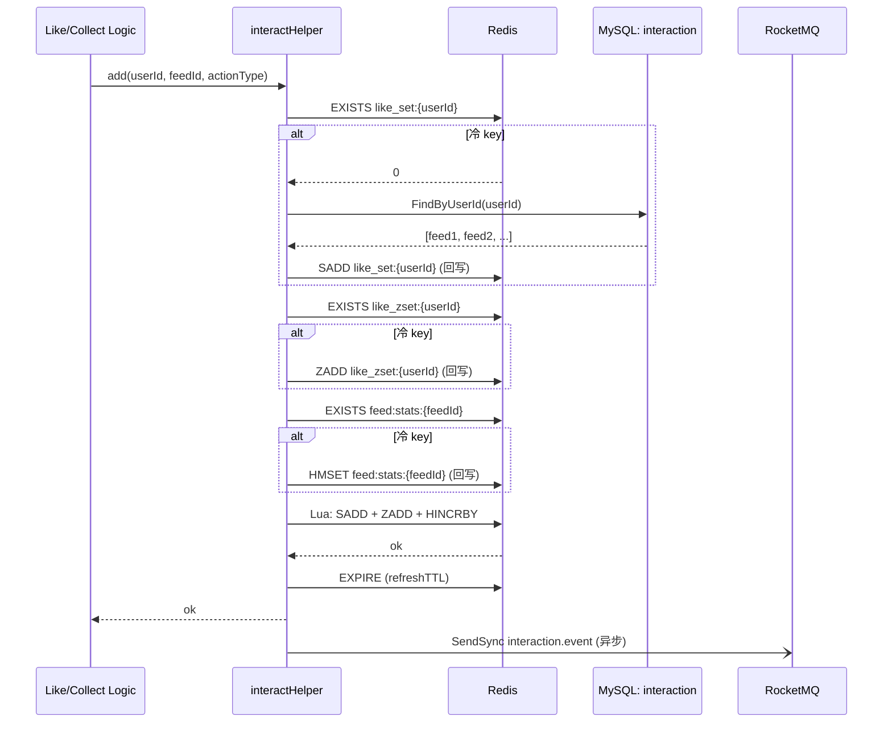

**remove（取消赞/收藏）**:

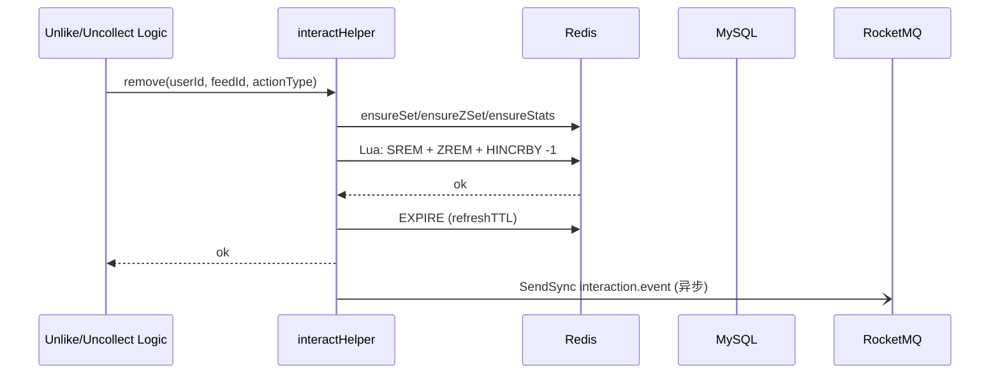

---

## LikeFeed / UnlikeFeed / CollectFeed / UncollectFeed

> 职责：点赞/取消赞/收藏/取消收藏——统一通过 `interactHelper.add/remove` 执行，返回操作后状态。

### 1. 入口与前置

- 入口：gRPC `Interaction.LikeFeed` / `UnlikeFeed` / `CollectFeed` / `UncollectFeed`
- 前置：Gateway 已校验 JWT，传入 userId

### 2. 参数校验

| 校验点 | 内容 | 失败错误码 |
|--------|------|-----------|
| userId / feedId | `<= 0` | `errorx.ParamError` |

### 3. 主流程

所有四个操作均为：

1. 构建 `interactionConstraint{userId, feedId, actionType:like/collect, isAdd:true/false}`
2. `interactHelper.add(ctx, c)` 或 `interactHelper.remove(ctx, c)`
3. 读回最新 `HGET feed:stats:{feedId}` → 返回 `InteractionStatus`（是否已赞/收藏 + 最新计数）

### 4. 依赖数据源清单

| 类型 | 名称 | 用途 | 关键说明 |
|------|------|------|----------|
| Redis | `interactHelper` 内部 | 核心操作 | 见上节 |
| Redis | `HGET feed:stats:{feedId}` | 返回最新计数 | — |
| MQ | `interaction.event` | 异步持久化 | 由 helper 内 publish |

### 5. 失败与降级策略

| 失败点 | 策略 | 说明 |
|--------|------|------|
| helper.add/remove 失败 | 整体失败 | — |
| 统计读失败 | 降级 | 返回 0 |

### 6. 副作用

- MQ → Worker 异步持久化。

### 7. 输出

- `pb.*Resp`：`IsLiked/IsCollected` + `LikeCount/CollectCount`

### 8. 数据流图

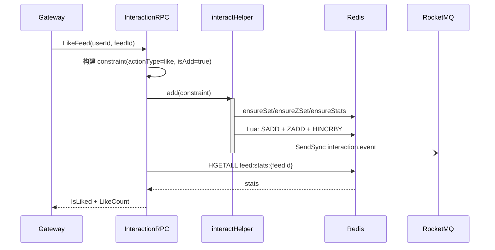

---

## GetFeedStats / BatchGetFeedStats

> 职责：获取帖子互动计数——`HGETALL feed:stats:{feedId}` Redis → 未命中回源 MySQL → `HSETNX` 回写。

### 1. 入口与前置

- 入口：gRPC `Interaction.GetFeedStats` / `BatchGetFeedStats`
- 前置：无

### 2. 主流程

**GetFeedStats**:
1. `HGETALL feed:stats:{feedId}` Redis
2. 命中 → 返回；未命中（空 Hash）→ `CountByFeedId(feedId)` MySQL
3. `HSETNX` 逐个字段回写

**BatchGetFeedStats**:
1. Pipeline `HGETALL feed:stats:{id1}` `HGETALL feed:stats:{id2}` ... Redis
2. 未命中收集 → `CountByFeedIds(missedIds)` MySQL `GROUP BY`
3. Pipeline `HSETNX` 逐个回写

### 3. 数据流图

**GetFeedStats**:

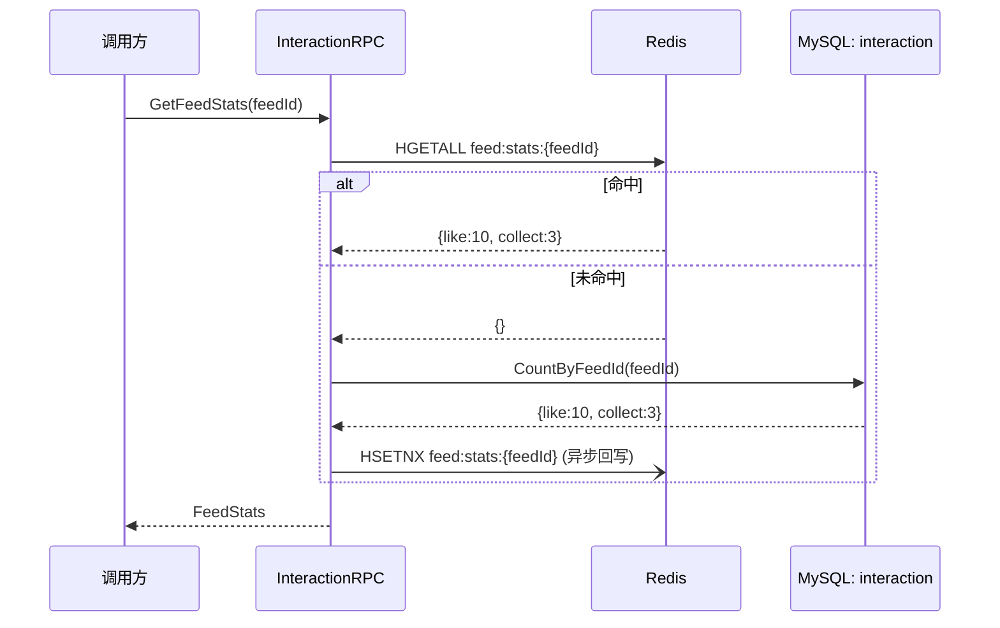

**BatchGetFeedStats**:

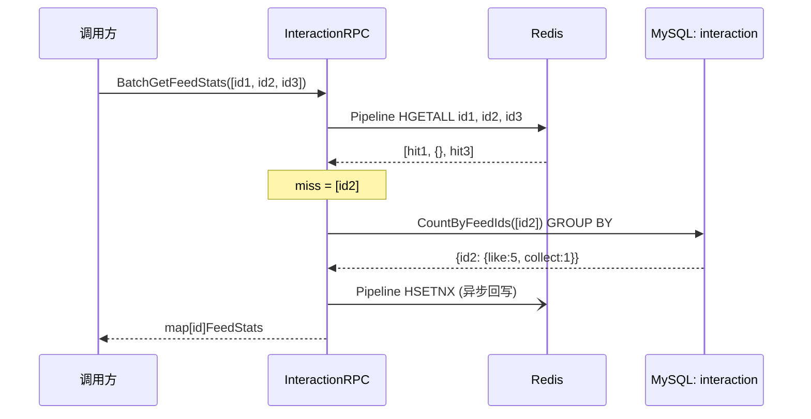

---

## GetUserInteractionStatus / BatchGetUserInteractionStatus

> 职责：查询用户对帖子的互动状态（是否已赞/已收藏）。

### 1. 入口与前置

- 入口：gRPC `Interaction.GetUserInteractionStatus` / `Batch...`
- 前置：无

### 2. 主流程

**GetUserInteractionStatus**:
1. `SISMEMBER like_set:{userId} feedId` → `IsLiked`
2. `SISMEMBER collect_set:{userId} feedId` → `IsCollected`

**BatchGetUserInteractionStatus**:
1. Pipeline `EXISTS like_set:{userId} collect_set:{userId}` → 冷 key
2. 冷 key 走 `FindByUserIdFeedIds` MySQL 回源 → `SADD` 回写
3. Pipeline `SISMEMBER` 全部 ids

### 3. 数据流图

**GetUserInteractionStatus**:

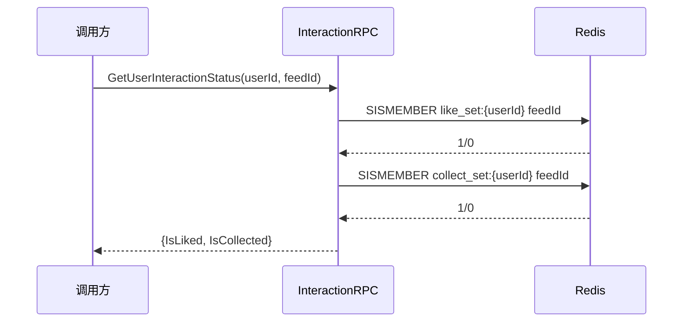

**BatchGetUserInteractionStatus**:

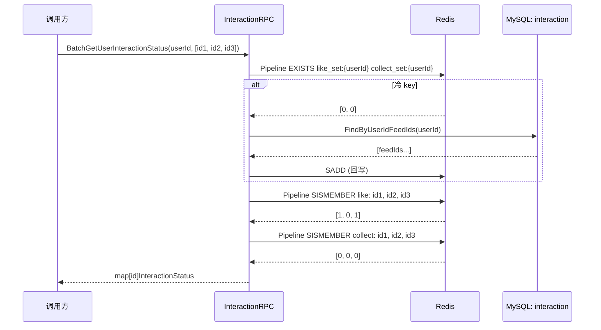

---

## GetUserLikedFeeds / GetUserCollectedFeeds

> 职责：用户赞过/收藏过的帖子列表——`ZREVRANGEBYSCORE` 游标分页。

### 1. 入口与前置

- 入口：gRPC `Interaction.GetUserLikedFeeds` / `GetUserCollectedFeeds`
- 前置：无

### 2. 主流程

1. `interactHelper.page(ctx, constraint)` → 内部 `ensureZSet` → `ZREVRANGEBYSCORE zsetKey max cursor WITHSCORES LIMIT 0 pageSize`
2. 结果去 `FeedRpc.BatchGetFeeds` 取帖子内容
3. 组装返回

### 3. 数据流图

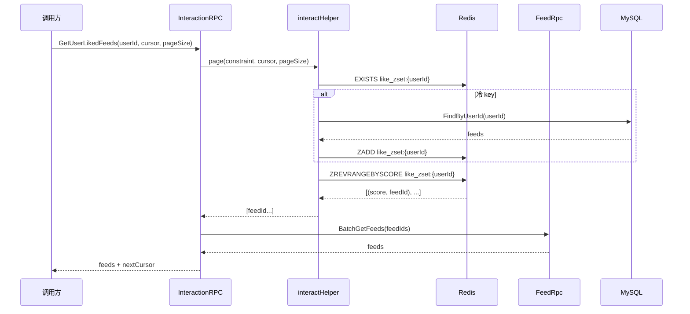

---

## GetFeedMetrics / BatchGetFeedMetrics

> 职责：帖子聚合指标——MySQL 按时间窗口累计（`feed_metrics_hourly` 聚合表）。

### 1. 入口与前置

- 入口：gRPC `Interaction.GetFeedMetrics` / `BatchGetFeedMetrics`
- 前置：无

### 2. 主流程

**GetFeedMetrics**:
1. `FeedRpc.GetFeed(feedId)` 获取帖子基本信息
2. `SumByFeedAndWindow(ctx, feedId, startTime, endTime)` MySQL 聚合查询
3. `metrics_calc.buildFeedMetrics(feed, sumRow)` 组装 pb 结构

**BatchGetFeedMetrics**:
1. `SumByFeedIDs(ctx, feedIds, startTime, endTime)` MySQL GROUP BY 批量聚合
2. 组装

### 3. 数据流图

**GetFeedMetrics**:

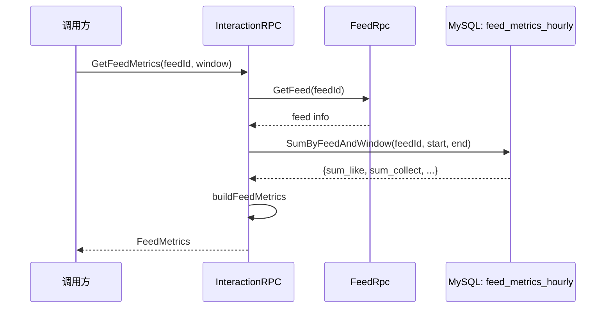

**BatchGetFeedMetrics**:

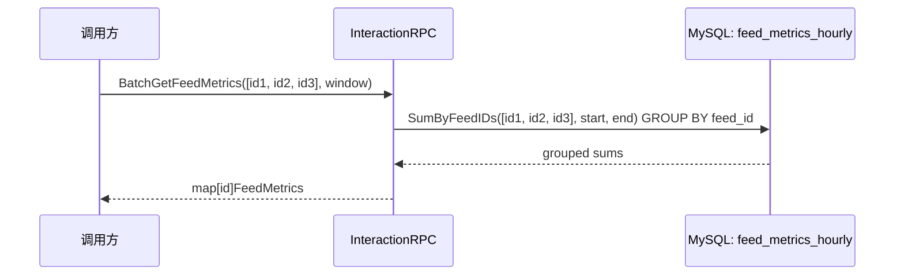

---

## GetCreatorMetrics

> 职责：创作者聚合指标——汇总作者全部帖子的指标数据。

### 1. 入口与前置

- 入口：gRPC `Interaction.GetCreatorMetrics`
- 前置：Gateway 已校验 JWT

### 2. 主流程

1. `FeedRpc.GetUserFeeds(userId, ...)` 获取作者全部帖子
2. `BatchGetFeedMetrics(feedIds, window)` 批量聚合指标
3. `aggregateFeedMetrics(allFeedsMetrics)` 汇总：总曝光/点赞/收藏/评论数 + 百分位
4. 可选：创作者本人校验（getMe 场景）

### 3. 数据流图

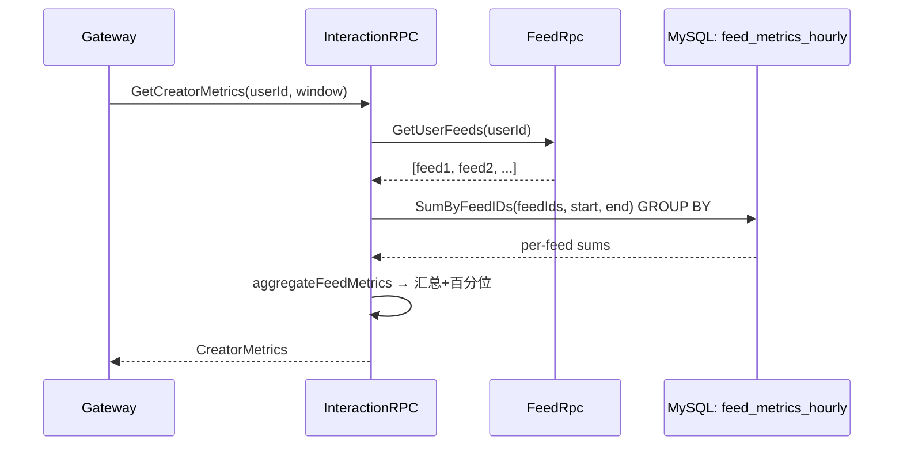

---

## GetPeerAverageMetrics

> 职责：同类平均值对比——Feed 信息 → Content 画像 → ES 搜索同级内容 → 聚合。

### 1. 入口与前置

- 入口：gRPC `Interaction.GetPeerAverageMetrics`
- 前置：无

### 2. 主流程

1. `FeedRpc.GetFeed(feedId)` 基础信息
2. `ContentRpc.GetContentProfile(feedId)` 画像（分类/标签/时长）
3. `ContentRpc.SearchContent(ctx, dsl)` ES 搜索同类内容（同分类+时长区间）
4. 过滤 ES 结果中与目标帖子时长偏差过大者
5. `SumByFeedIDs(ctx, peerFeedIds, window)` MySQL 聚合同类指标
6. 计算百分位（目标值在同类中的位置）

### 3. 数据流图

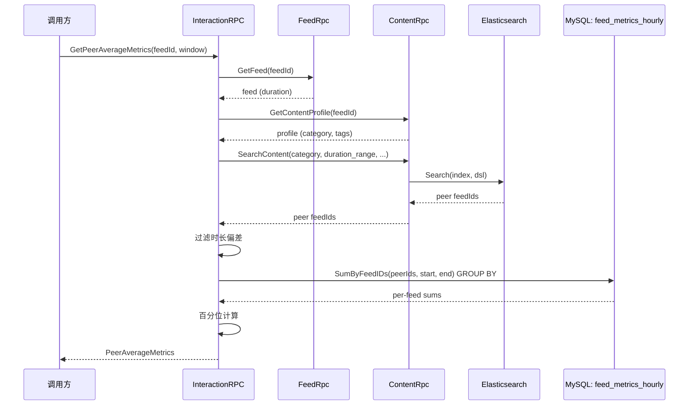

---

## GetUserInterestProfile

> 职责：用户兴趣画像——Redis 快照 → 未命中回源 MySQL → 比例计算。

### 1. 入口与前置

- 入口：gRPC `Interaction.GetUserInterestProfile`
- 前置：无

### 2. 主流程

1. `interest.BuildSnapshot(ctx, userId)` Redis `HGETALL interest:{userId}`
2. 命中 → 直接使用；未命中 → `FindOneByUserId(ctx, userId)` MySQL
3. 计算各兴趣类目的占比

### 3. 数据流图

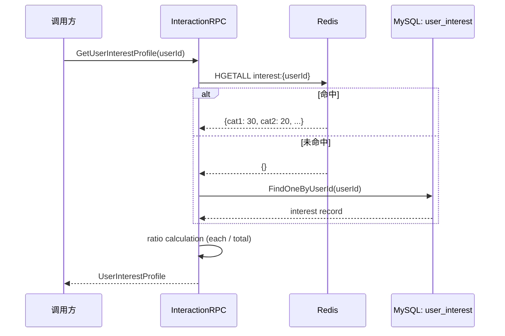

---

## 持久化 Worker

> 职责：消费 `interaction.event` MQ，将 Redis 先行写入的数据幂等持久化到 MySQL。

### 1. 入口

- 异步消费 `interaction.event` topic

### 2. 主流程

1. 反序列化事件 → `userId, feedId, actionType, isAdd`
2. `FindOneByUserIdFeedId(ctx, userId, feedId)` MySQL 查已有记录
3. 存在 → `UpdateStatusIfNewer(ctx, record, newStatus)`（幂等，仅更新更新的）
4. 不存在 → `Insert(ctx, record)`
   - 并发冲突（1062 Duplicate Key）→ 转为 Update

### 3. 数据流图

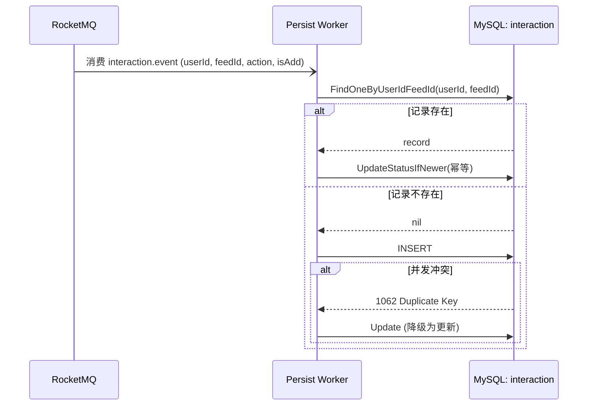

---

## BehaviorWorker

> 职责：消费 `interaction.event` → 去重 → 行为记录落库 → 小时桶指标累计（Lua HINCRBY）。

### 1. 入口

- 异步消费 `interaction.event` topic

### 2. 主流程

**消费时**:
1. `SETNX behavior:dedup:{eventId} 1 ttl` Redis 去重
2. `ruleRejudge` 规则复审（质量/作弊检测）
3. `EXPOSE` 摘要上报（可选）
4. `Insert(ctx, &FeedBehaviorEvent{...})` MySQL 落行为明细
5. Lua `HINCRBY feed:metrics:{feedId}:{hour_bucket} like_count 1` 小时桶累计
6. `HINCRBY interest:{userId} {category} 1` 兴趣画像增量

**flushLoop（定时）**:
1. `claimDirty()` 获取脏小时桶列表
2. `HGETALL feed:metrics:{id}:{bucket}` → 检查指标合理性（quality check）
3. `Upsert(ctx, &FeedMetricsHourly{...})` 写入 MySQL 聚合表

### 3. 数据流图

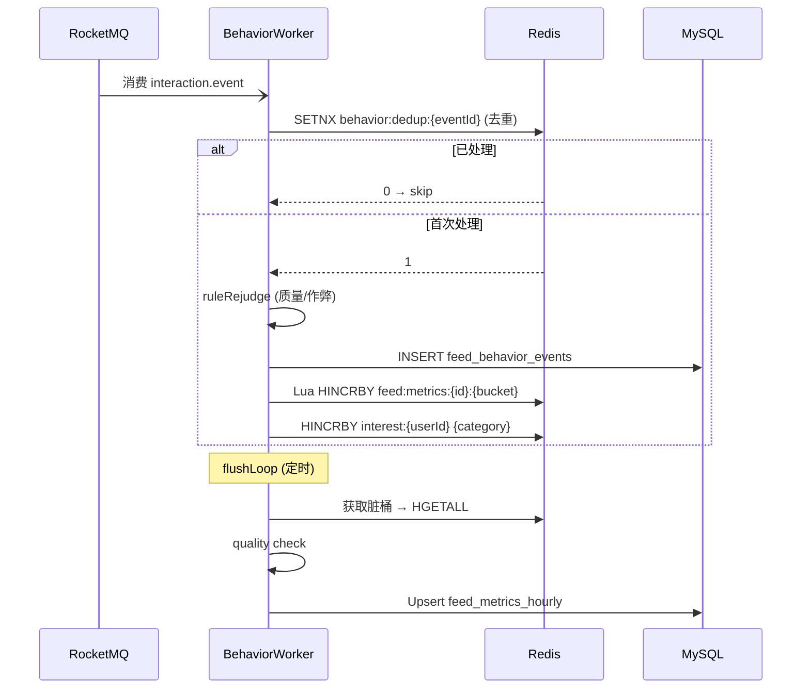

---

## 关联文档

- [Interaction 设计总览](./00-overview.md)
- [点赞](./02-like/02-like.md)
- [收藏](./03-collect/03-collect.md)
- [缓存策略](./06-cache/06-cache.md)
- [MQ 事件](./07-mq-event/07-mq-event.md)
- [创作者指标](../agent/08-creator-metrics.md)
- [用户兴趣画像](../agent/06-user-interest.md)
- [Logic 数据流生成提示词](../../agent/logic-dataflow-guide.md)
