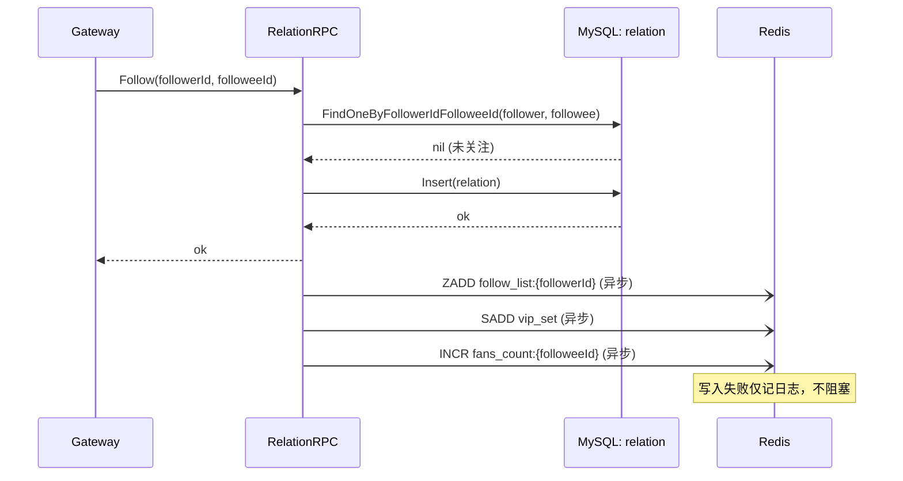
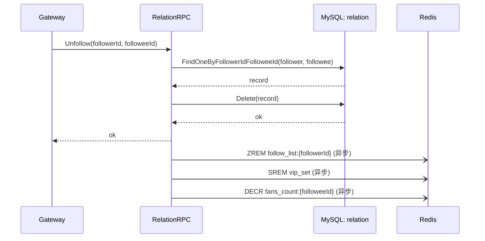
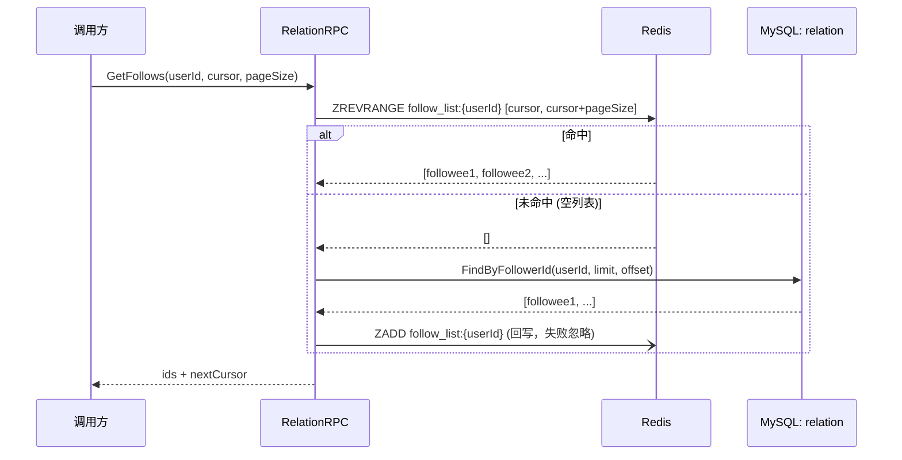
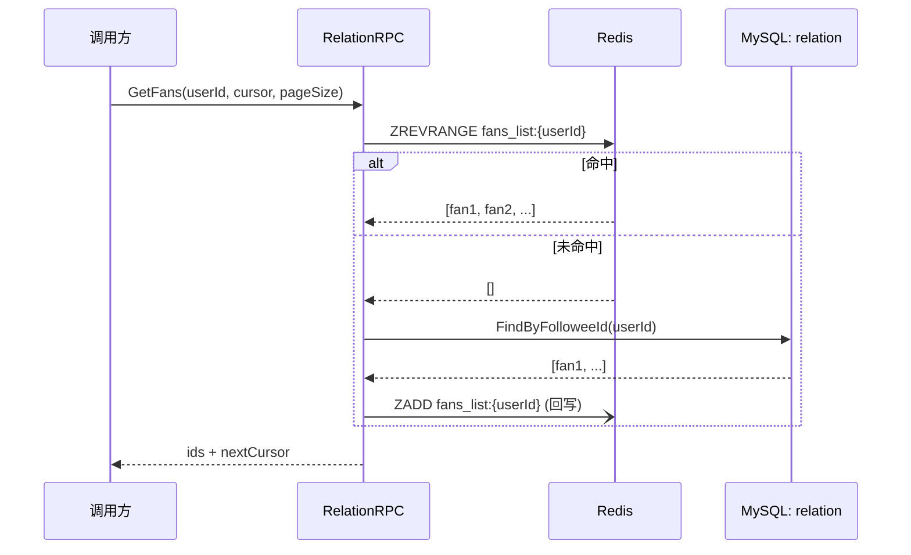
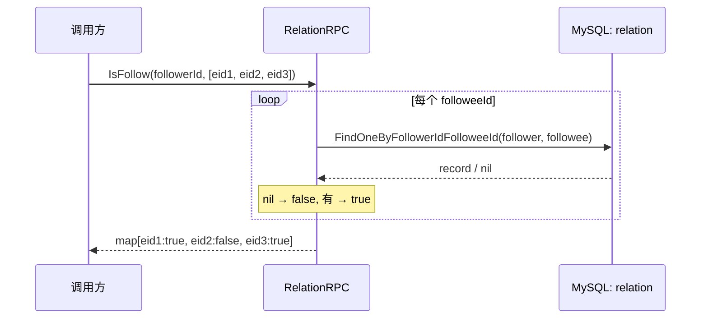
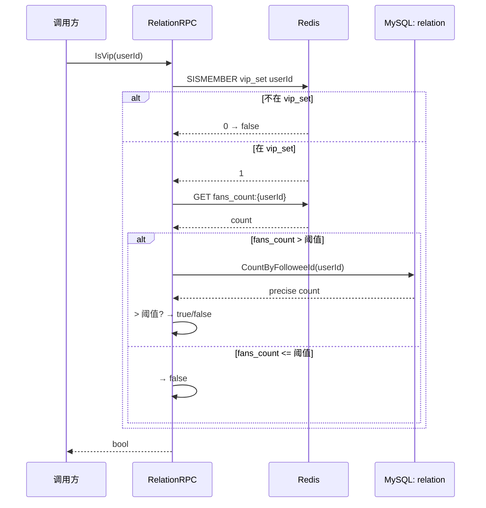
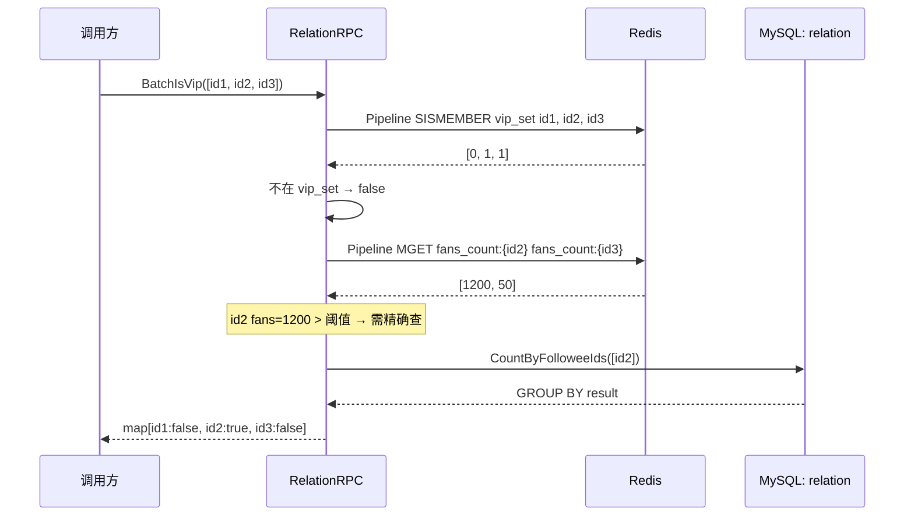

# Relation 服务数据流

> 覆盖 `app/relation/rpc/internal/logic/` 下全部 7 个 logic 的数据流说明。

---

## Follow

> 职责：关注用户——DB 查重 → 插入关注记录 → 异步写 Redis（follow_list + vip_set + fans_count）。

### 1. 入口与前置

- 入口：gRPC `Relation.Follow`
- 前置：Gateway 已校验 JWT，传入 followerId

### 2. 参数校验

| 校验点 | 内容 | 失败错误码 |
|--------|------|-----------|
| followerId | `<= 0` | `errorx.ParamError` |
| followeeId | `<= 0` | `errorx.ParamError` |
| followerId == followeeId | 不可自关注 | `errorx.ParamError` |

### 3. 主流程

1. `Model.FindOneByFollowerIdFolloweeId(ctx, followerId, followeeId)` → 已存在 → `errorx.AlreadyFollowed`
2. `Model.Insert(ctx, &relation{...})` 写 MySQL
3. 异步 goroutine：
   - `ZADD follow_list:{followerId} {now} {followeeId}` 关注列表
   - `SADD vip_set {followeeId}` VIP 候选（异步）
   - `INCR fans_count:{followeeId}` 粉丝计数

### 4. 依赖数据源清单

| 类型 | 名称 | 用途 | 关键说明 |
|------|------|------|----------|
| MySQL | `relation.FindOneByFollowerIdFolloweeId` | 查重 | — |
| MySQL | `relation.Insert` | 落库 | — |
| Redis | `ZADD follow_list:{followerId}` | 关注列表 | 异步 goroutine |
| Redis | `SADD vip_set` | VIP 候选 | 异步 |
| Redis | `INCR fans_count:{followeeId}` | 粉丝计数 | 异步 |

### 5. 失败与降级策略

| 失败点 | 策略 | 说明 |
|--------|------|------|
| 已关注 | 整体失败 | `errorx.AlreadyFollowed` |
| DB Insert 失败 | 整体失败 | — |
| Redis 异步写入失败 | 忽略 | 仅记日志，FanOut 读取时会回源 MySQL |

### 6. 副作用

- 异步 goroutine 写 Redis：ZADD / SADD / INCR。

### 7. 输出

- `pb.FollowResp`：确认消息

### 8. 数据流图

---

## Unfollow

> 职责：取关用户——DB 检查 → 删除记录 → 同步写 Redis（ZREM / SREM / DECR）。

### 1. 入口与前置

- 入口：gRPC `Relation.Unfollow`
- 前置：Gateway 已校验 JWT

### 2. 参数校验

| 校验点 | 内容 | 失败错误码 |
|--------|------|-----------|
| followerId | `<= 0` | `errorx.ParamError` |
| followeeId | `<= 0` | `errorx.ParamError` |

### 3. 主流程

1. `FindOneByFollowerIdFolloweeId(...)` → nil → `errorx.NotFollowedYet`
2. `Model.Delete(ctx, record)` 删除 MySQL 记录
3. 异步 goroutine：
   - `ZREM follow_list:{followerId} {followeeId}`
   - `SREM vip_set {followeeId}`（关注数不足时清除）
   - `DECR fans_count:{followeeId}`

### 4. 依赖数据源清单

| 类型 | 名称 | 用途 | 关键说明 |
|------|------|------|----------|
| MySQL | `relation.FindOneByFollowerIdFolloweeId` | 确认为关注状态 | — |
| MySQL | `relation.Delete` | 删除记录 | — |
| Redis | `ZREM/SREM/DECR` | 清除缓存 | 异步 goroutine |

### 5. 失败与降级策略

| 失败点 | 策略 | 说明 |
|--------|------|------|
| 未关注 | 整体失败 | `errorx.NotFollowedYet` |
| Delete 失败 | 整体失败 | — |
| Redis 异步失败 | 忽略 | 仅记日志 |

### 6. 副作用

- 异步 Redis 清理。

### 7. 输出

- `pb.UnfollowResp`：确认消息

### 8. 数据流图

---

## GetFollows

> 职责：查询关注列表——ZREVRANGE Redis → 未命中回源 MySQL → ZADD 回写。

### 1. 入口与前置

- 入口：gRPC `Relation.GetFollows`
- 前置：无

### 2. 参数校验

| 校验点 | 内容 | 失败错误码 |
|--------|------|-----------|
| userId | `<= 0` | `errorx.ParamError` |
| cursor/pageSize | 分页参数校验 | `errorx.ParamError` |

### 3. 主流程

1. `ZREVRANGE follow_list:{userId} cursor cursor+pageSize` Redis 查
2. 命中 → 返回 ids
3. 未命中（空列表）→ `FindByFollowerId(userId, limit, offset)` MySQL 回源
4. `ZADD follow_list:{userId}` 回写 Redis（含 score）

### 4. 依赖数据源清单

| 类型 | 名称 | 用途 | 关键说明 |
|------|------|------|----------|
| Redis | `ZREVRANGE follow_list:{userId}` | 关注列表 | 按时间倒序 |
| MySQL | `relation.FindByFollowerId` | 回源 | — |
| Redis | `ZADD follow_list:{userId}` | 回写 | 失败忽略 |

### 5. 失败与降级策略

| 失败点 | 策略 | 说明 |
|--------|------|------|
| Redis 故障 | 降级 | 直接回源 MySQL |
| ZADD 回写失败 | 忽略 | 仅记日志 |

### 6. 副作用

- Redis ZADD 回写。

### 7. 输出

- `pb.GetFollowsResp`：`[]userId` + `nextCursor`

### 8. 数据流图

---

## GetFans

> 职责：查询粉丝列表——ZREVRANGE Redis → 未命中回源 MySQL → 回写。

### 1. 入口与前置

- 入口：gRPC `Relation.GetFans`
- 前置：无

### 2. 参数校验

同 GetFollows（userId + cursor/pageSize）。

### 3. 主流程

1. `ZREVRANGE fans_list:{userId} cursor cursor+pageSize` Redis
2. 命中 → 返回
3. 未命中 → `FindByFolloweeId(userId)` MySQL → `ZADD` 回写

### 4. 依赖数据源清单

| 类型 | 名称 | 用途 | 关键说明 |
|------|------|------|----------|
| Redis | `ZREVRANGE fans_list:{userId}` | 粉丝列表 | 按时间倒序 |
| MySQL | `relation.FindByFolloweeId` | 回源 | — |
| Redis | `ZADD fans_list:{userId}` | 回写 | 失败忽略 |

### 5. 失败与降级策略

| 失败点 | 策略 | 说明 |
|--------|------|------|
| Redis 故障 | 降级 | 直接回源 MySQL |

### 6. 副作用

- Redis ZADD 回写。

### 7. 输出

- `pb.GetFansResp`：`[]userId` + `nextCursor`

### 8. 数据流图

---

## IsFollow

> 职责：单/批量检查是否关注——循环 FindOneByFollowerIdFolloweeId。

### 1. 入口与前置

- 入口：gRPC `Relation.IsFollow`
- 前置：无

### 2. 参数校验

| 校验点 | 内容 | 失败错误码 |
|--------|------|-----------|
| followerId | `<= 0` | `errorx.ParamError` |
| followeeIds | 非空 | `errorx.ParamError` |

### 3. 主流程

1. `for followeeId in followeeIds`:
   - `FindOneByFollowerIdFolloweeId(followerId, followeeId)` → nil → false，非 nil → true

### 4. 依赖数据源清单

| 类型 | 名称 | 用途 | 关键说明 |
|------|------|------|----------|
| MySQL | `relation.FindOneByFollowerIdFolloweeId` × N | 逐条查 | 无缓存，直接走 DB |

### 5. 失败与降级策略

| 失败点 | 策略 | 说明 |
|--------|------|------|
| 单条 FindOne 失败 | 降级 | 返回 false |

### 6. 副作用

- 无。

### 7. 输出

- `pb.IsFollowResp`：`map[followeeId]bool`

### 8. 数据流图

---

## IsVip

> 职责：判断是否大 V——SISMEMBER vip_set → 命中 + fans_count > 阈值 → true。

### 1. 入口与前置

- 入口：gRPC `Relation.IsVip`
- 前置：无

### 2. 参数校验

| 校验点 | 内容 | 失败错误码 |
|--------|------|-----------|
| userId | `<= 0` | `errorx.ParamError` |

### 3. 主流程

1. `SISMEMBER vip_set userId` Redis → 不在则直接返回 false
2. 在 vip_set → `GET fans_count:{userId}` → 并发数 ≤ 阈值 → false
3. 并发数 > 阈值 → `CountByFolloweeId(userId)` MySQL 精确计数
4. MySQL 结果 > 阈值 → true，否则 false

### 4. 依赖数据源清单

| 类型 | 名称 | 用途 | 关键说明 |
|------|------|------|----------|
| Redis | `SISMEMBER vip_set` | VIP 候选 | — |
| Redis | `GET fans_count:{userId}` | 近似粉丝数 | — |
| MySQL | `relation.CountByFolloweeId` | 精确粉丝数 | 仅在 Redis 计数超阈值时触发 |

### 5. 失败与降级策略

| 失败点 | 策略 | 说明 |
|--------|------|------|
| Redis 不可用 | 降级 | 直接走 MySQL CountByFolloweeId |
| SISMEMBER 返回 0 | 降级 | 直接返回 false |
| fans_count 缓存不准确 | 降级 | 触发 MySQL 精确计数 |

### 6. 副作用

- 无。

### 7. 输出

- `pb.IsVipResp`：`bool`

### 8. 数据流图

---

## BatchIsVip

> 职责：批量判断是否大 V——Pipeline SISMEMBER + MGET fans_count → miss → GROUP BY 回源。

### 1. 入口与前置

- 入口：gRPC `Relation.BatchIsVip`
- 前置：无

### 2. 参数校验

| 校验点 | 内容 | 失败错误码 |
|--------|------|-----------|
| userIds | 非空 | `errorx.ParamError` |

### 3. 主流程

1. Pipeline `SISMEMBER vip_set userId` 全部 ids
2. 不在 vip_set 的 → 直接 false
3. 在 vip_set 的 → Pipeline `GET fans_count:{userId}`
4. fans_count > 阈值的 → `CountByFolloweeIds(ids)` MySQL `GROUP BY user_id`
5. 综合判定返回 `map[userId]bool`

### 4. 依赖数据源清单

| 类型 | 名称 | 用途 | 关键说明 |
|------|------|------|----------|
| Redis | Pipeline `SISMEMBER` | 批量查 VIP 候选 | — |
| Redis | Pipeline `MGET` | 批量取 fans_count | — |
| MySQL | `CountByFolloweeIds(GROUP BY)` | 精确粉丝数 | 仅超阈值时触发 |

### 5. 失败与降级策略

| 失败点 | 策略 | 说明 |
|--------|------|------|
| Redis 不可用 | 降级 | 全部走 MySQL CountByFolloweeIds |
| 单条 fans_count 不准 | 降级 | 触发 GROUP BY 精确查 |

### 6. 副作用

- 无。

### 7. 输出

- `pb.BatchIsVipResp`：`map[userId]bool`

### 8. 数据流图

---

## 关联文档

- [Logic 数据流生成提示词](../../agent/logic-dataflow-guide.md)
