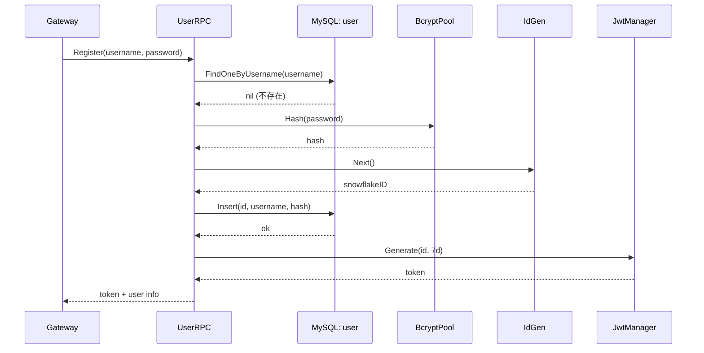
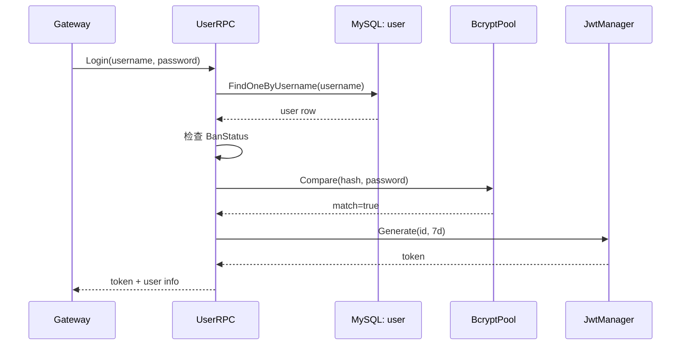
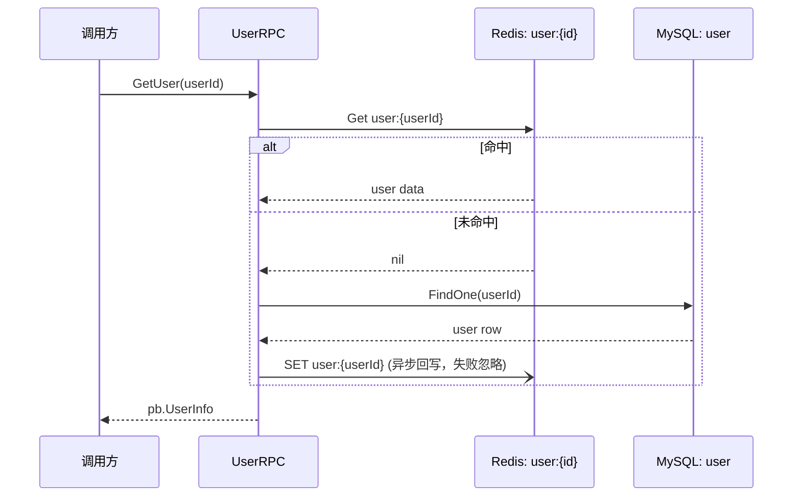
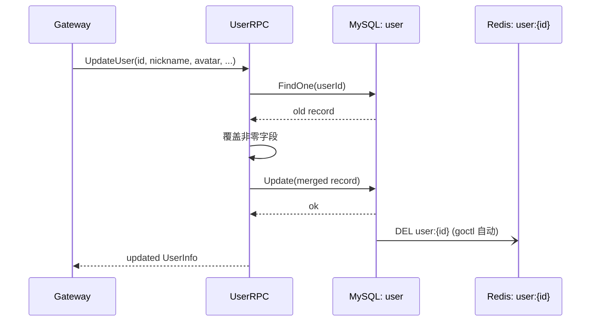
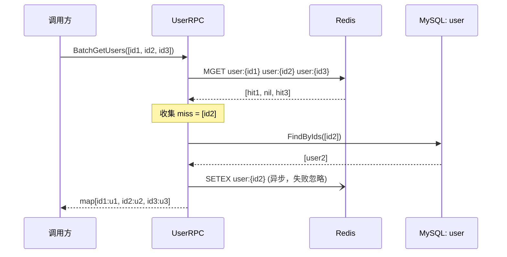

# User 服务数据流

> 覆盖 `app/user/rpc/internal/logic/` 下全部 5 个 logic 文件的数据流说明。

---

## Register

> 职责：用户注册——用户名去重 → bcrypt 哈希 → Snowflake 发号 → MySQL 落库 → JWT 签发。

### 1. 入口与前置

- 入口：gRPC `User.Register`
- 前置：无（注册无需鉴权）

### 2. 参数校验

| 校验点 | 内容 | 失败错误码 |
|--------|------|-----------|
| username | 非空 | `errorx.ParamError` |
| password | 非空 | `errorx.ParamError` |

### 3. 主流程

1. `Model.FindOneByUsername(ctx, username)` 查重 → 已存在 → `errorx.UserAlreadyExists`
2. `BcryptPool.Hash(ctx, password)` 生成哈希
3. `IdGen.Next()` 生成 Snowflake userID
4. `Model.Insert(ctx, &model.User{Id: id, Username: username, PasswordHash: hash, ...})` 落库
5. `JwtManager.Generate(id, 7*24*time.Hour)` 签发 JWT

### 4. 依赖数据源清单

| 类型 | 名称 | 用途 | 关键说明 |
|------|------|------|----------|
| MySQL | `user.FindOneByUsername` | 查重 | — |
| MySQL | `user.Insert` | 落库 | — |
| 外部 | `IdGen` | Snowflake 发号 | `common/idgen` |
| 外部 | `BcryptPool` | 密码哈希 | 异步池 |
| 外部 | `JwtManager` | 签发 token | 7 天有效期 |

### 5. 失败与降级策略

| 失败点 | 策略 | 说明 |
|--------|------|------|
| 用户名已存在 | 整体失败 | `errorx.UserAlreadyExists` |
| Insert 失败 | 整体失败 | 透传 DB 错误 |
| Bcrypt/Jwt/IdGen | 整体失败 | 基础设施不可用则拒绝服务 |

### 6. 副作用

- 无 MQ 事件。

### 7. 输出

- `pb.RegisterResp`：`Token`（JWT）、`User`（新建用户信息）

### 8. 数据流图

---

## Login

> 职责：用户登录——用户名查 DB → 状态校验 → bcrypt 比对 → JWT 签发。

### 1. 入口与前置

- 入口：gRPC `User.Login`
- 前置：无

### 2. 参数校验

| 校验点 | 内容 | 失败错误码 |
|--------|------|-----------|
| username | 非空 | `errorx.ParamError` |
| password | 非空 | `errorx.ParamError` |

### 3. 主流程

1. `Model.FindOneByUsername(ctx, username)` → nil → `errorx.UserNotFound`
2. 检查 `BanStatus` → 已封禁 → `errorx.UserBanned`
3. `BcryptPool.Compare(ctx, user.PasswordHash, password)` → 不匹配 → `errorx.PasswordError`
4. `JwtManager.Generate(user.Id, 7*24*time.Hour)` 签发

### 4. 依赖数据源清单

| 类型 | 名称 | 用途 | 关键说明 |
|------|------|------|----------|
| MySQL | `user.FindOneByUsername` | 查用户 | — |
| 外部 | `BcryptPool` | 密码比对 | — |
| 外部 | `JwtManager` | 签发 token | 7 天有效期 |

### 5. 失败与降级策略

| 失败点 | 策略 | 说明 |
|--------|------|------|
| 用户不存在 | 整体失败 | `errorx.UserNotFound` |
| 已封禁 | 整体失败 | `errorx.UserBanned` |
| 密码错误 | 整体失败 | `errorx.PasswordError` |

### 6. 副作用

- 无。

### 7. 输出

- `pb.LoginResp`：`Token`、`User`

### 8. 数据流图

---

## GetUser

> 职责：按 ID 查询用户，走 goctl 内置 cache-aside（Redis → MySQL → 回写）。

### 1. 入口与前置

- 入口：gRPC `User.GetUser`
- 前置：无

### 2. 参数校验

| 校验点 | 内容 | 失败错误码 |
|--------|------|-----------|
| userId | `<= 0` | `errorx.ParamError` |

### 3. 主流程

1. `Model.FindOne(ctx, userId)` — goctl 内置 cache-aside：
   - 命中 Redis `user:{id}` → 直接返回；
   - 未命中 → MySQL `SELECT` → 回写 Redis → 返回。

### 4. 依赖数据源清单

| 类型 | 名称 | 用途 | 关键说明 |
|------|------|------|----------|
| Redis | `user:{userId}` | 缓存 | goctl cache-aside，自动回写 |
| MySQL | `user.FindOne` | 回源 | — |

### 5. 失败与降级策略

| 失败点 | 策略 | 说明 |
|--------|------|------|
| FindOne 未找到 | 整体失败 | `errorx.UserNotFound` |
| Redis 故障 | 整体失败 | goctl 内置处理 |
| 回写失败 | 忽略 | 不阻塞返回 |

### 6. 副作用

- 缓存回写（goctl 内置，失败不阻塞）。

### 7. 输出

- `pb.UserInfo`：直接映射 user 表字段。

### 8. 数据流图

---

## UpdateUser

> 职责：更新用户信息——查出现有记录 → 覆盖非零字段 → Update（goctl 自动清除缓存）。

### 1. 入口与前置

- 入口：gRPC `User.UpdateUser`
- 前置：Gateway 已校验 JWT 身份并传入 callerId

### 2. 参数校验

| 校验点 | 内容 | 失败错误码 |
|--------|------|-----------|
| userId | `<= 0` | `errorx.ParamError` |

### 3. 主流程

1. `Model.FindOne(ctx, userId)` 取出旧记录
2. 用请求非零字段覆盖 `Nickname/Avatar/Signature/Gender/Birthday`
3. `Model.Update(ctx, user)` — goctl 自动删除对应 Redis 缓存

### 4. 依赖数据源清单

| 类型 | 名称 | 用途 | 关键说明 |
|------|------|------|----------|
| MySQL | `user.FindOne` | 取旧值 | — |
| MySQL | `user.Update` | 写回 | 自动清除 `user:{id}` 缓存 |

### 5. 失败与降级策略

| 失败点 | 策略 | 说明 |
|--------|------|------|
| FindOne 未找到 | 整体失败 | `errorx.UserNotFound` |
| Update 失败 | 整体失败 | 透传 DB 错误 |

### 6. 副作用

- 缓存失效：goctl Update 自动 DEL `user:{id}`。

### 7. 输出

- `pb.UpdateUserResp`：更新后的 `UserInfo`

### 8. 数据流图

---

## BatchGetUsers

> 职责：批量查询用户，MGET Redis → 未命中 IN 回源 MySQL → SETEX 回写。

### 1. 入口与前置

- 入口：gRPC `User.BatchGetUsers`
- 前置：无

### 2. 参数校验

| 校验点 | 内容 | 失败错误码 |
|--------|------|-----------|
| userIds | 非空 | `errorx.ParamError` |

### 3. 主流程

1. `MGET user:{id1} user:{id2} ...` Redis 批量获取
2. 收集 `miss` 列表 → `FindByIds(ctx, missedIds)` MySQL `WHERE id IN (…)`
3. `SETEX` 逐个回写命中的 key

### 4. 依赖数据源清单

| 类型 | 名称 | 用途 | 关键说明 |
|------|------|------|----------|
| Redis | `MGET user:{id}` | 批量缓存读 | — |
| MySQL | `user.FindByIds` | 回源补全 | `WHERE id IN (…)` |
| Redis | `SETEX` | 回写 | 异步，失败忽略 |

### 5. 失败与降级策略

| 失败点 | 策略 | 说明 |
|--------|------|------|
| Redis 故障 | 整体回源 MySQL | 降级为全量 DB 查询 |
| FindByIds 部分未找到 | 忽略 | 仅返回命中的用户 |
| SETEX 失败 | 忽略 | 不阻塞返回 |

### 6. 副作用

- 异步缓書き込み（SETEX）。

### 7. 输出

- `pb.BatchGetUsersResp`：`map[userId]*UserInfo`，仅包含命中的用户。

### 8. 数据流图

---

## 关联文档

- [Logic 数据流生成提示词](../../agent/logic-dataflow-guide.md)
